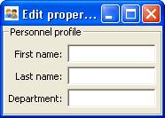

.. index:: View; internal, View; external, View; ways of displaying
   pair: View; context
   
.. _advanced-view-concepts:

======================
Advanced View Concepts
======================

The preceding chapters of this Guide give an overview of how to use the View
class to quickly construct a simple window for a single HasTraits object. This
chapter explores a number of more complex techniques that significantly increase
the power and versatility of the View object.

* *Internal Views:* Views can be defined as attributes of a HasTraits class; 
  one class can have multiple views. View attributes can be inherited by 
  subclasses.
* *External Views:* A view can be defined as a module variable, inline as a
  function or method argument, or as an attribute of a :term:`Handler`.
* *Ways of displaying Views:* You can display a View by calling 
  configure_traits() or edit_traits() on a HasTraits object, or by calling the
  ui() method on the View object.
* *View context:* You can pass a context to any of the methods for displaying
  views, which is a dictionary of labels and objects. In the default case, this
  dictionary contains only one object, referenced as 'object', but you can 
  define contexts that contain multiple objects.
* *Include objects:* You can use an Include object as a placeholder for view
  items defined elsewhere.

.. index: View; internal
  
.. _internal-views:

Internal Views
--------------

In the examples thus far, the View objects have been external. That is to say,
they have been defined outside the model (HasTraits object or objects) that they
are used to display. This approach is in keeping with the separation of the two
concepts prescribed by the :term:`MVC` design pattern.

There are cases in which it is useful to define a View within a HasTraits class.
In particular, it can be useful to associate one or more Views with a particular
type of object so that they can be incorporated into other parts of the
application with little or no additional programming. Further, a View that is
defined within a model class is inherited by any subclasses of that class, a
phenomenon called *visual inheritance*.

.. _defining-a-default-view:

Defining a Default View
```````````````````````
index:: default view, View; default

It is easy to define a default view for a HasTraits class: simply create a View
attribute called **traits_view** for that class. Consider the following
variation on Example 3:

.. index:: configure_traits(); default view example,  default view; example
.. index:: examples; default view
   
.. _example-5-using-configure-traits-with-a-default-view-object:

.. rubric:: Example 5: Using configure_traits() with a default View object

::

    # default_traits_view.py -- Sample code to demonstrate the use of 
    #                           'traits_view'
    from traits.api import HasTraits, Str, Int
    from traitsui.api import View, Item, Group
    import traitsui
    
    class SimpleEmployee2(HasTraits):
        first_name = Str
        last_name = Str
        department = Str
    
        employee_number = Str
        salary = Int
    
        traits_view = View(Group(Item(name = 'first_name'),
                                 Item(name = 'last_name'),
                                 Item(name = 'department'),
                                 label = 'Personnel profile',
                                 show_border = True))
    
    sam = SimpleEmployee2()
    sam.configure_traits()

In this example, configure_traits() no longer requires a *view* keyword
argument; the **traits_view** attribute is used by default, resulting in the
same display as in Figure 3:


   
   Figure 5: User interface for Example 5
   

It is not strictly necessary to call this View attribute **traits_view**. If
exactly one View attribute is defined for a HasTraits class, that View is always
treated as the default display template for the class. However, if there are
multiple View attributes for the class (as discussed in the next section), if
one is named 'traits_view', it is always used as the default.

.. index:: View; multiple, multiple Views

.. _defining-multiple-views-within-the-model:

Defining Multiple Views Within the Model
````````````````````````````````````````

Sometimes it is useful to have more than one pre-defined view for a model class.
In the case of the SimpleEmployee class, one might want to have both a "public
information" view like the one above and an "all information" view. One can do
this by simply adding a second View attribute:

.. index::
   pair: examples; multiple Views
   
.. _example-6-defining-multiple-view-objects-in-a-hastraits-class:

.. rubric:: Example 6: Defining multiple View objects in a HasTraits class

::

    # multiple_views.py -- Sample code to demonstrate the use of 
    #                      multiple views
    from traits.api import HasTraits, Str, Int
    from traitsui.api import View, Item, Group
    import traitsui
    
    class SimpleEmployee3(HasTraits):
        first_name = Str
        last_name = Str
        department = Str
    
        employee_number = Str
        salary = Int
    
        traits_view = View(Group(Item(name = 'first_name'),
                                 Item(name = 'last_name'),
                                 Item(name = 'department'),
                                 label = 'Personnel profile',
                                 show_border = True))
    
        all_view = View(Group(Item(name = 'first_name'),
                              Item(name = 'last_name'),
                              Item(name = 'department'),
                              Item(name = 'employee_number'),
                              Item(name = 'salary'),
                              label = 'Personnel database ' + 
                                      'entry',
                              show_border = True))
    
    sam = SimpleEmployee3()
    sam.configure_traits()
    sam.configure_traits(view='all_view')

.. index:: traits_view attribute, configure_traits(); view parameter

As before, a simple call to configure_traits() for an object of this class
produces a window based on the default View (**traits_view**). In order to use
the alternate View, use the same syntax as for an external view, except that the
View name is specified in single quotes to indicate that it is associated with
the object rather than being a module-level variable::

    configure_traits(view='all_view').
    
Note that if more than one View is defined for a model class, you must indicate
which one is to be used as the default by naming it ``traits_view``. Otherwise,
Traits UI gives preference to none of them, and instead tries to construct a
default View, resulting in a simple alphabetized display as described in
:ref:`the-view-and-its-building-blocks`. For this reason, it is usually
preferable to name a model's default View traits_view even if there are no other
Views; otherwise, simply defining additional Views, even if they are never
used, can unexpectedly change the behavior of the GUI.

.. index:: View; external

.. _separating-model-and-view-external-views:

Separating Model and View: External Views
-----------------------------------------

In all the preceding examples in this guide, the concepts of model and view have
remained closely coupled. In some cases the view has been defined in the model
class, as in :ref:`internal-views`; in other cases the configure_traits() method
that produces a window from a View has been called from a HasTraits object.
However, these strategies are simply conveniences; they are not an intrinsic
part of the relationship between model and view in Traits UI. This section
begins to explore how the Traits UI package truly supports the separation of
model and view prescribed by the :term:`MVC` design pattern.

An *external* view is one that is defined outside the model classes. In Traits
UI, you can define a named View wherever you can define a variable or class
attribute. [7]_ A View can even be defined in-line as a function or method
argument, for example::

    object.configure_traits(view=View(Group(Item(name='a'),
                                            Item(name='b'),
                                            Item(name='c')))
                                            
However, this approach is apt to obfuscate the code unless the View is very
simple.

:ref:`Example 2 <example-2-using-configure-traits-with-a-view-object>` through
:ref:`Example 4 <example-4-using-a-view-object-with-buttons>` demonstrate
external Views defined as variables. One advantage of this convention is that
the variable name provides an easily accessible "handle" for re-using the View.
This technique does not, however, support visual inheritance.

A powerful alternative is to define a View within the :term:`controller`
(Handler) class that controls the window for that View. [8]_ This technique is
described in :ref:`controlling-the-interface-the-handler`.

.. index:: View; methods for displaying

.. _displaying-a-view:

Displaying a View
-----------------

Traits UI provides three methods for creating a window or panel from a View
object. The first two, configure_traits() and edit_traits(), are defined on the
HasTraits class, which is a superclass of all Traits-based model classes, as
well as of Handler and its subclasses. The third method, ui(), is defined on the
View class itself.

.. index:: configure_traits(); method

.. _configure-traits:

configure_traits()
``````````````````

The configure_traits() method creates a standalone window for a given View
object, i.e., it does not require an existing GUI to run in. It is therefore
suitable for building command-line functions, as well as providing an accessible
tool for the beginning Traits UI programmer.

The configure_traits() method also provides options for saving 
:term:`trait attribute` values to and restoring them from a file. Refer to the
*Traits API Reference* for details.

.. index:: edit_traits()

.. _edit-traits:

edit_traits()
`````````````

The edit_traits() method is very similar to configure_traits(), with two major
exceptions. First, it is designed to run from within a larger application whose
GUI is already defined. Second, it does not provide options for saving data to
and restoring data from a file, as it is assumed that these operations are
handled elsewhere in the application.

.. index:: ui()

.. _ui:

ui()
````

The View object includes a method called ui(), which performs the actual
generation of the window or panel from the View for both edit_traits() and
configure_traits(). The ui() method is also available directly through the
Traits UI API; however, using one of the other two methods is usually
preferable. [9]_

The ui() method has five keyword parameters:

* *kind*
* *context*
* *handler*
* *parent*
* *view_elements*

The first four are identical in form and function to the corresponding arguments
of edit_traits(), except that *context* is not optional; the following section
explains why.

The fifth argument, *view_elements*, is used only in the context of a call to
ui() from a model object method, i.e., from configure_traits() or edit_traits(),
Therefore it is irrelevant in the rare cases when ui() is used directly by
client code. It contains a dictionary of the named :term:`ViewElement` objects
defined for the object whose configure_traits() (or edit_traits()) method was
called..

.. index:: context

.. _the-view-context:

The View Context
----------------

All three of the methods described in :ref:`displaying-a-view` have a *context*
parameter. This parameter can be a single object or a dictionary of
string/object pairs; the object or objects are the model objects whose traits
attributes are to be edited. In general a "context" is a Python dictionary whose
keys are strings; the key strings are used to look up the values. In the case of
the *context* parameter to the ui() method, the dictionary values are objects.
In the special case where only one object is relevant, it can be passed directly
instead of wrapping it in a dictionary.

When the ui() method is called from configure_traits() or edit_traits() on a
HasTraits object, the relevant object is the HasTraits object whose method was
called. For this reason, you do not need to specify the *context* argument in
most calls to configure_traits() or edit_traits(). However, when you call the
ui() method on a View object, you *must* specify the *context* parameter, so
that the ui() method receives references to the objects whose trait attributes
you want to modify.

So, if configure_traits() figures out the relevant context for you, why call
ui() at all? One answer lies in *multi-object Views*.

.. index:: multi-object Views, View; multi-object

.. _multi-object-views:

Multi-Object Views
``````````````````

A multi-object view is any view whose contents depend on multiple "independent"
model objects, i.e., objects that are not attributes of one another. For
example, suppose you are building a real estate listing application, and want to
display a window that shows two properties side by side for a comparison of
price and features. This is straightforward in Traits UI, as the following
example shows:

.. index:: examples; context, context; examples, examples; multi-object Views
.. index:: multi-object Views; examples
   
.. _example-7-using-a-multi-object-view-with-a-context:

.. rubric:: Example 7: Using a multi-object view with a context

::

    # multi_object_view.py -- Sample code to show multi-object view 
    #                         with context
    
    from traits.api import HasTraits, Str, Int, Bool
    from traitsui.api import View, Group, Item
    
    # Sample class
    class House(HasTraits):
       address = Str
       bedrooms = Int
       pool = Bool
       price = Int
    
    # View object designed to display two objects of class 'House'
    comp_view = View(
        Group(
            Group(
                Item('h1.address', resizable=True),
                Item('h1.bedrooms'),
                Item('h1.pool'),
                Item('h1.price'),
                show_border=True
            ),
            Group(
                Item('h2.address', resizable=True),
                Item('h2.bedrooms'),
                Item('h2.pool'),
                Item('h2.price'),
                show_border=True
            ),
            orientation = 'horizontal'
        ),
        title = 'House Comparison'
    )
    # A pair of houses to demonstrate the View
    house1 = House(address='4743 Dudley Lane', 
                   bedrooms=3, 
                   pool=False, 
                   price=150000)
    house2 = House(address='11604 Autumn Ridge', 
                   bedrooms=3, 
                   pool=True, 
                   price=200000)
    
    # ...And the actual display command
    house1.configure_traits(view=comp_view, context={'h1':house1,  
                                                     'h2':house2})
                                                     
.. FIXME: This is a bit assymmetrical. Can we clean it up without complicating
   the example overly?

The resulting window has the desired appearance: [10]_

.. figure:: images/ui_for_ex7.jpg
   :alt: UI showing side-by-side groups.
         
   Figure 6: User interface for Example 7
    
For the purposes of this particular example, it makes sense to create a separate
Group for each model object, and to use two model objects of the same class.
Note, however, that neither is a requirement.

.. index:: extended trait names; Item name attribute

Notice that the Item definitions in Example 7 use the same type of extended
trait attribute syntax as is supported for the on_trait_change() dynamic trait
change notification method. In fact, Item **name** attributes can reference any
trait attribute that is reachable from an object in the context. This is true
regardless of whether the context contains a single object or multiple objects.
For example::

    Item('object.axle.chassis.serial_number')

Because an Item can refer only to a single trait, do not use extended trait
references that refer to multiple traits, since the behavior of such references
is not defined. Also, avoid extended trait references where one of the
intermediate objects could be None, because there is no way to obtain a valid
reference from None.

Refer to the *Traits User Manual*, in the chapter on trait notification, for
details of the extended trait name syntax.

.. index:: 
   object: Include

.. _include-objects:

Include Objects
---------------
   
In addition to the Item and Group class, a third building block class for Views
exists in Traits UI: the Include class. For the sake of completeness, this
section gives a brief description of Include objects and their purpose and
usage. However, they are not commonly used as of this writing, and should be
considered unsupported pending redesign.

In essence, an Include object is a placeholder for a named Group or Item object
that is specified outside the Group or View in which it appears. For example,
the following two definitions, taken together, are equivalent to the third:

.. index:: 
   pair: examples; Include
   
.. _example-8-using-an-include-object:

.. rubric:: Example 8: Using an Include object

::

    # This fragment...
    my_view = View(Group(Item('a'),
                         Item('b')),
                   Include('my_group'))
    
    # ...plus this fragment...
    my_group = Group(Item('c'),
                     Item('d'),
                     Item('e'))
    
    #...are equivalent to this:
    my_view = View(Group(Item('a'),
                         Item('b')),
                   Group(Item('c'),
                         Item('d'),
                         Item('e'))
                         
This opens an interesting possibility when a View is part of a model class: any
Include objects belonging to that View can be defined differently for different
instances or subclasses of that class. This technique is called *view
parameterization*.

.. rubric:: Footnotes

.. [7] Note that although the definition of a View within a HasTraits class has
   the syntax of a trait attribute definition, the resulting View is not stored 
   as an attribute of the class.
   
.. [8] Assuming there is one; not all GUIs require an explicitly defined
   Handler.
   
.. [9] One possible exception is the case where a View object is defined as a
   variable (i.e., outside any class) or within a custom Handler, and is 
   associated more or less equally with multiple model objects; see 
   :ref:`multi-object-views`.

.. [10] If the script were designed to run within an existing GUI, it would make
   sense to replace the last line with 
   ``comp_view.ui(context={'h1': house1, 'h2': house2})``, since neither object
   particularly dominates the view. However, the examples in this Guide are
   designed to be fully executable from the Python command line, which is why 
   configure_traits() was used instead.
   
