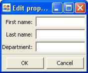

.. index:: View; customizing

.. _customizing-a-view:

==================
Customizing a View
==================

As shown in the preceding two chapters, it is possible to specify a window in
Traits UI simply by creating a View object with the appropriate contents. In
designing real-life applications, however, you usually need to be able to
control the appearance and behavior of the windows themselves, not merely their
content. This chapter covers a variety of options for tailoring the appearance
of a window that is created using a View, including the type of window that a
View appears in, the :term:`command button`\ s that appear in the window, and
the physical properties of the window.

.. index:: kind attribute

.. _specifying-window-type-the-kind-attribute:

Specifying Window Type: the **kind** Attribute
----------------------------------------------

Many types of windows can be used to display the same data content. A form can
appear in a window, a wizard, or an embedded panel; windows can be *modal*
(i.e., stop all other program processing until the box is dismissed) or not, and
can interact with live data or with a buffered copy. In Traits UI, a single View
can be used to implement any of these options simply by modifying its **kind**
attribute. There are seven possible values of **kind**:

.. index:: modal; window kind, live; window  kind, livemodal window kind
.. index:: nonmodal window kind, wizard; window kind, panel; window kind
.. index:: subpanel; window kind

*  'modal'
*  'live'
*  'livemodal'
*  'nonmodal'
*  'wizard'
*  'panel'
*  'subpanel'

These alternatives are described below. If the **kind** attribute of a View
object is not specified, the default value is 'modal'.

.. index:: windows; stand-alone, modal; definition, live; definition

.. _stand-alone-windows:

Stand-alone Windows
```````````````````

The behavior of a stand-alone Traits UI window can vary over two significant
degrees of freedom. First, it can be :term:`modal`, meaning that when the window
appears, all other GUI interaction is suspended until the window is closed; if
it is not modal, then both the window and the rest of the GUI remain active and
responsive. Second, it can be :term:`live`, meaning that any changes that the
user makes to data in the window is applied directly and immediately to the
underlying model object or objects; otherwise the changes are made to a copy of
the model data, and are only copied to the model when the user commits them
(usually by clicking an :guilabel:`OK` or :guilabel:`Apply` button; see
:ref:`command-buttons-the-buttons-attribute`). The four possible combinations of
these behaviors correspond to four of the possible values of the 'kind '
attribute of the View object, as shown in the following table.

.. _matrix-of-traits-ui-windows-table:

.. rubric:: Matrix of Traits UI windows

+-------------+----------------+-----------------+
|             |not modal       |modal            |
+=============+================+=================+
|**not live** |:term:`nonmodal`|:term:`modal`    |
+-------------+----------------+-----------------+
|**live**     |:term:`live`    |:term:`livemodal`|
+-------------+----------------+-----------------+

All of these window types are identical in appearance. Also, all types support
the **buttons** attribute, which is described in
:ref:`command-buttons-the-buttons-attribute`. Usually, a window with command
buttons is called a :term:`dialog box`.

.. TODO: Add diagrams and/or examples to clarify.

.. index:: wizard, windows; wizard

.. _wizards:

Wizards
```````

Unlike a window, whose contents generally appear as a single page or a tabbed
display, a :term:`wizard` is presented as a series of pages that a user must
navigate sequentially.

.. TODO: Add a reference to the section on the organization of Views via 
   Groups, once it's been added.
   
.. TODO: add code and screenshot for a simple tabbed display and of the same
   View presented as a Wizard.

Traits UI Wizards are always modal and live. They always display a standard
wizard button set; i.e., they ignore the **buttons** View attribute. In short,
wizards are considerably less flexible than windows, and are primarily suitable
for highly controlled user interactions such as software installation.

.. index:: panel, subpanel, windows; panel, windows; subpanel

.. _panels-and-subpanels:

Panels and Subpanels
````````````````````

Both dialog boxes and wizards are secondary windows that appear separately from
the main program display, if any. Often, however, you might need to create a
window element that is embedded in a larger display. For such cases, the
**kind** of the corresponding View object should be 'panel' or 'subpanel '.

A :term:`panel` is very similar to a window, except that it is embedded in a
larger window, which need not be a Traits UI window. Like windows, panels
support the **buttons** View attribute, as well as any menus and toolbars that
are specified for the View (see :ref:`menus-and-menu-bars`). Panels are always
live and nonmodal.

A :term:`subpanel` is almost identical to a panel. The only difference is that
subpanels do not display :term:`command button`\ s even if the View specifies
them.

.. Do subpanels support menus and toolbars? If not, add this to the 
   documentation. (If so, why do they?)

.. index:: buttons; attribute

.. _command-buttons-the-buttons-attribute:

Command Buttons: the **buttons** Attribute
------------------------------------------

A common feature of many windows is a row of command buttons along the bottom of
the frame. These buttons have a fixed position outside any scrolled panels in
the window, and are thus always visible while the window is displayed. They are
usually used for window-level commands such as committing or cancelling the
changes made to the form data, or displaying a help window.

In Traits UI, these command buttons are specified by means of the View object's
**buttons** attribute, whose value is a list of buttons to display. [6]_
Consider the following variation on Example 3:

.. index:: 
   pair: examples; buttons
   
.. _example-4-using-a-view-object-with-buttons:

.. rubric:: Example 4: Using a View object with buttons

::

    # configure_traits_view_buttons.py -- Sample code to demonstrate 
    #                                     configure_traits()
    
    from traits.api import HasTraits, Str, Int
    from traitsui.api import View, Item
    from traitsui.menu import OKButton, CancelButton
    
    class SimpleEmployee(HasTraits):
        first_name = Str
        last_name = Str
        department = Str
    
        employee_number = Str
        salary = Int
    
    view1 = View(Item(name = 'first_name'),
                 Item(name = 'last_name'),
                 Item(name = 'department'),
                 buttons = [OKButton, CancelButton])
    
    sam = SimpleEmployee()
    sam.configure_traits(view=view1)    

The resulting window has the same content as before, but now two buttons are
displayed at the bottom: :guilabel:`OK` and :guilabel:`Cancel`:


   
   Figure 4: User interface for Example 4

There are six standard buttons defined by Traits UI. Each of the standard
buttons has matching a string alias. You can either import and use the button
names, or simply use their aliases:

.. index:: buttons; standard, UndoButton, ApplyButton, RevertButton, OKButton
.. index:: CancelButton

.. _command-button-aliases-table:

.. rubric:: Command button aliases

+--------------+---------------------------+
|Button Name   |Button Alias               |
+==============+===========================+
|UndoButton    |'Undo'                     |
+--------------+---------------------------+
|ApplyButton   |'Apply'                    |
+--------------+---------------------------+
|RevertButton  |'Revert'                   |
+--------------+---------------------------+
|OKButton      |'OK'  (case sensitive!)    |
+--------------+---------------------------+
|CancelButton  |'Cancel'                   |
+--------------+---------------------------+

Alternatively, there are several pre-defined button lists that can be imported
from traitsui.menu and assigned to the buttons attribute:

.. index:: OKCancelsButtons, ModalButtons, LiveButtons

* OKCancelButtons = ``[OKButton, CancelButton ]``
* ModalButtons = ``[ ApplyButton, RevertButton, OKButton, CancelButton, HelpButton ]``
* LiveButtons = ``[ UndoButton, RevertButton, OKButton, CancelButton, HelpButton ]``

Thus, one could rewrite the lines in Example 4 as follows, and the
effect would be exactly the same::

    from traitsui.menu import OKCancelButtons
    
                 buttons = OKCancelButtons

.. index:: NoButtons

The special constant NoButtons can be used to create a window or panel
without command buttons. While this is the default behavior, NoButtons can
be useful for overriding an explicit value for **buttons**. You can also specify
``buttons = []`` to achieve the same effect. Setting the **buttons** attribute
to an empty list has the same effect as not defining it at all.

It is also possible to define custom buttons and add them to the **buttons**
list; see :ref:`custom-command-buttons` for details.

.. index:: View; attributes, attributes; View

.. _other-view-attributes:

Other View Attributes
---------------------

.. index:: dock attribute; View, height attribute; View, icon attribute
.. index:: image attribute; View, item_theme attribute; View
.. index:: label_theme attribute; View, resizable attribute; View
.. index:: scrollable attribute, statusbar attribute, style attribute; View
.. index:: title attribute, width attribute; View, x attribute, y attribute

.. _attributes-of-view-by-category-table:

.. rubric:: Attributes of View, by category

+----------+---------------------+---------------------------------------------+
|Category  |Attributes           |Description                                  |
+==========+=====================+=============================================+
|Window    |* **dock**           |These attributes control the visual          |
|display   |* **height**         |properties of the window itself, regardless  |
|          |* **icon**           |of its content.                              |
|          |* **image**          |                                             |
|          |* **item_theme**     |.. index:: close_result attribute            |
|          |* **label_theme**	 |.. index:: handler attribute                 |
|          |* **resizable**      |.. index:: key_bindings attribute            |
|          |* **scrollable**     |.. index:: menubar attribute                 |
|          |* **statusbar**      |.. index:: model_view attribute              |
|          |* **style**          |.. index:: on_apply attribute                |
|          |* **title**          |.. index:: toolbar attribute                 |
|          |* **width**          |.. index:: updated attribute                 |
|          |* **x**              |.. index:: content attribute; View           |
|          |* **y**              |.. index:: drop_class attribute              |
+----------+---------------------+---------------------------------------------+
|Command   |* **close_result**	 |Traits UI menus and toolbars are generally   |
|          |* **handler**        |implemented in conjunction with custom       |
|          |* **key_bindings**   |:term:`Handler`\ s; see                      |
|          |* **menubar**        |:ref:`menus-and-menu-bars` for details. The  |
|          |* **model_view**     |**key_bindings** attribute references the set|
|          |* **on_apply**       |of global key bindings for the view.         |
|          |* **toolbar**        |                                             |
|          |* **updated**        |.. index:: export attribute; View            |
|          |                     |.. index:: imports attribute                 |
|          |                     |.. index:: object attribute; View            |
+----------+---------------------+---------------------------------------------+
|Content   |* **content**        |The **content** attribute is the top-level   |
|          |* **drop_class**	 |Group object for the view. The **object**    |
|          |* **export**         |attribute is the  object being edited. The   |
|          |* **imports**        |**imports** and **drop_class** attributes    |
|          |* **object**         |control what objects can be dragged and      |
|          |                     |dropped on the view.                         |
|          |                     |                                             |
|          |                     |.. index:: help attribute; View              |
|          |                     |.. index:: help_id attribute; View           |
+----------+---------------------+---------------------------------------------+
|User help |* **help**           |The **help** attribute is a deprecated way to|
|          |* **help_id**        |specify that the View has a Help button. Use |
|          |                     |the buttons attribute instead (see           |
|          |                     |:ref:`command-buttons-the-buttons-attribute` |
|          |                     |for details). The **help_id** attribute is   |
|          |                     |not used by Traits, but can be used by a     |
|          |                     |custom help handler.                         |
|          |                     |                                             |
|          |                     |.. index:: id attribute; View                |
+----------+---------------------+---------------------------------------------+
|Unique    |* **id**             |The **id** attribute is used as a key to save|
|identifier|                     |user preferences about a view, such as       |
|          |                     |customized size and position, so that they   |
|          |                     |are restored the next time the view is       |
|          |                     |opened. The value of **id** must be unique   |
|          |                     |across all Traits-based applications on a    |
|          |                     |system. If no value is specified, no user    |
|          |                     |preferences are saved for the view.          |
+----------+---------------------+---------------------------------------------+

 
.. rubric:: Footnotes

.. [6] Actually, the value of the **buttons** attribute is really a list of
   Action objects, from which GUI buttons are generated by Traits UI. The 
   Action class is described in :ref:`actions`.

