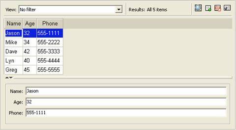
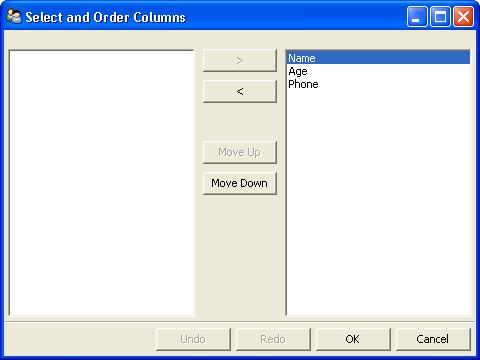
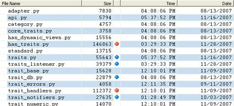
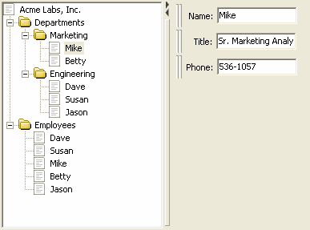
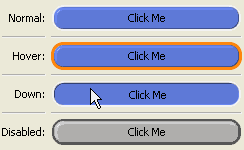
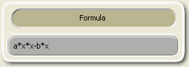

.. _advanced-trait-editors:

Advanced Trait Editors
----------------------

The editor factories described in the following sections are more advanced than
those in the previous section. In some cases, they require writing additional
code; in others, the editors they generate are intended for use in complex user
interfaces, in conjunction with other editors.

CustomEditor()
``````````````

:Suitable for:
    Special cases
:Default for:
    (none)
:Required parameters:
    *factory*
:Optional parameters:
    *args*
    
Use CustomEditor() to create an "editor" that is a non-Traits-based custom
control. The *factory* parameter must be a function that generates the custom
control. The function must have the following signature:

factory_function(*window_parent*, *editor*[, \*\ *args*, \*\*\ *kwargs*])

- *window_parent*: The parent window for the control
- *editor*: The editor object created by CustomEditor()

Additional arguments, if any, can be passed as a tuple in the *args* parameter
of CustomEditor().

For an example of using CustomEditor(),examine the implementation of the
NumericModelExplorer class in the enthought.model.numeric_model_explorer module;
CustomEditor() is used to generate the plots in the user interface.


DropEditor()
````````````

:Suitable for:
    Instance traits
:Default for:
    (none)
:Optional parameters:
    *binding*, *klass*, *readonly*
    
DropEditor() generates an editor that is a text field containing a string
representation of the trait attribute's value. The user can change the value
assigned to the attribute by dragging and dropping an object on the text field,
for example, a node from a tree editor (See :ref:`treeeditor`). If the
*readonly* parameter is True (the default), the user cannot modify the value by
typing in the text field.

You can restrict the class of objects that can be dropped on the editor by
specifying the *klass* parameter.

You can specify that the dropped object must be a binding
(enthought.naming.api.Binding) by setting the *binding* parameter to True. If
so, the bound object is retrieved and checked to see if it can be assigned to
the trait attribute.

If the dropped object (or the bound object associated with it) has a method
named drop_editor_value(), it is called to obtain the value to assign to the
trait attribute. Similarly, if the object has a method named
drop_editor_update(), it is called to update the value displayed in the text
editor. This method requires one parameter, which is the GUI control for the
text editor.


DNDEditor()
```````````

:Suitable for:
    Instance traits
:Default for:
    (none)
:Optional parameters:
    *drag_target, drop_target, image*
    
DNDEditor() generates an editor that represents a file or a HasTraits instance
as an image that supports dragging and dropping. Depending on the editor style,
the editor can be a *drag source* (the user can set the value of the trait
attribute by dragging a file or object onto the editor, for example, from a tree
editor), or *drop target* (the user can drag from the editor onto another
target).

.. _drag-and-drop-editor-style-variations-table:

.. rubric:: Table 9: Drag-and-drop editor style variations

============  ============  ============
Editor Style  Drag Source?  Drop Target?
============  ============  ============
Simple        Yes           Yes
Custom        No            Yes
Read-only     Yes           No
============  ============  ============


KeyBindingEditor()
``````````````````

The KeyBindingEditor() factory differs from other trait editor factories because
it generates an editor, not for a single attribute, but for an object of a
particular class, traitsui.key_bindings.KeyBindings. A KeyBindings
object is a list of bindings between key codes and handler methods. You can
specify a KeyBindings object as an attribute of a View. When the user presses a
key while a View has input focus, the user interface searches the View for a
KeyBindings that contains a binding that corresponds to the key press; if such a
binding does not exist on the View, it searches enclosing Views in order, and
uses the first matching binding, if any. If it does not find any matching
bindings, it ignores the key press.

A key binding editor is a separate :term:`dialog box` that displays the string
representation of each key code and a description of the corresponding method.
The user can click a text box, and then press a key or key combination to
associate that key press with a method.

.. figure:: images/key_binding_editor.jpg
   :alt: Dialog box with fields for key presses corresponding to operations
   
   Figure 50: Key binding editor dialog box

The following code example creates a user interface containing a code editor
with associated key bindings, and a button that invokes the key binding editor.

.. _example-17-code-editor-with-key-binding-editor:

.. rubric:: Example 17: Code editor with key binding editor

:: 

    # key_bindings.py -- Example of a code editor with a 
    #                    key bindings editor
    
    from traits.api \
        import Button, Code, HasPrivateTraits, Str
    from traitsui.api \
        import View, Item, Group, Handler, CodeEditor
    from traitsui.key_bindings \
        import KeyBinding, KeyBindings
    
    key_bindings = KeyBindings(
        KeyBinding( binding1    = 'Ctrl-s',
                    description = 'Save to a file',
                    method_name = 'save_file' ),
        KeyBinding( binding1    = 'Ctrl-r',
                    description = 'Run script',
                    method_name = 'run_script' ),
        KeyBinding( binding1    = 'Ctrl-k',
                    description = 'Edit key bindings',
                    method_name = 'edit_bindings' )  
    )  
                  
    # Traits UI Handler class for bound methods
    class CodeHandler ( Handler ):
        
        def save_file ( self, info ):
            info.object.status = "save file"
            
        def run_script ( self, info ):
            info.object.status = "run script"
            
        def edit_bindings ( self, info ):
            info.object.status = "edit bindings"
            key_bindings.edit_traits()        
                   
    class KBCodeExample ( HasPrivateTraits ):
        
        code   = Code
        status = Str
        kb    = Button(label='Edit Key Bindings')
        
        view = View( Group (
                     Item( 'code', 
                           style     = 'custom',
                           resizable = True ),
                     Item('status', style='readonly'),
                     'kb',
                     orientation = 'vertical',
                     show_labels = False,
                     ),
                   id = 'KBCodeExample',
                   key_bindings = key_bindings,
                   title = 'Code Editor With Key Bindings',
                   resizable = True,
    
                   handler   = CodeHandler() )
                   
        def _kb_fired( self, event ):
            key_bindings.edit_traits()
              
    
    if __name__ == '__main__':
        KBCodeExample().configure_traits()

.. _tableeditor:

TableEditor()
`````````````

:Suitable for:
    List(*InstanceType*)
:Default for:
    (none)
:Required parameters:
    *columns* or *columns_name*
:Optional parameters:
    See *Traits API Reference*, 
    traitsui.wx.table_editor.ToolkitEditorFactory attributes.
    
TableEditor() generates an editor that displays instances in a list as rows in a
table, with attributes of the instances as values in columns. You must specify
the columns in the table. Optionally, you can provide filters for filtering the
set of displayed items, and you can specify a wide variety of options for
interacting with and formatting the table.


   
   Figure 51: Table editor

To see the code that results in Figure 51, refer to :file:`TableEditor_demo.py`
in the :file:`demos/Traits UI Demo/Standard Editors` subdirectory of the Traits
UI package. This example demonstrates object columns, expression columns,
filters, searching, and adding and deleting rows.

The parameters for TableEditor() can be grouped in several broad categories,
described in the following sections.

- :ref:`specifying-columns`
- :ref:`managing-items`
- :ref:`editing-the-table`
- :ref:`defining-the-layout`
- :ref:`table-defining-the-format`
- :ref:`other-user-interactions`

.. _specifying-columns:

Specifying Columns
::::::::::::::::::

You must provide the TableEditor() factory with a list of columns for the table.
You can specify this list directly, as the value of the *columns* parameter, or
indirectly, in an extended context attribute referenced by the *columns_name*
parameter.

The items in the list must be instances of traitsui.api.TableColumn,
or of a subclass of TableColumn. Some subclasses of TableColumn that are
provided by the Traits UI package include ObjectColumn, ListColumn,
NumericColumn, and ExpressionColumn. (See the *Traits API Reference* for details
about these classes.) In practice, most columns are derived from one of these
subclasses, rather than from TableColumn. For the usual case of editing trait
attributes on objects in the list, use ObjectColumn. You must specify the *name*
parameter to the ObjectColumn() constructor, referencing the name of the trait
attribute to be edited.

You can specify additional columns that are not initially displayed using the
*other_columns* parameter. If the *configurable* parameter is True (the
default), a :guilabel:`Set user preferences for table` icon (|preferences_icon|)
appears on the table's toolbar. When the user clicks this icon, a dialog box
opens that enables the user to select and order the columns displayed in the
table, as shown in Figure 52. (The dialog box is implemented using a set editor;
see :ref:`seteditor`.) Any columns that were specified in the *other_columns*
parameter are listed in the left list box of this dialog box, and can be
displayed by moving them into the right list box.

.. |preferences_icon| image:: images/table_prefs.gif
 

   
   Figure 52: Column selection dialog box for a table editor

.. _managing-items:

Managing Items
::::::::::::::

Table editors support several mechanisms to help users locate items of interest.

.. _organizing-items:

Organizing Items
~~~~~~~~~~~~~~~~

Table editors provide two mechanisms for the user to organize the contents of a
table: sorting and reordering. The user can sort the items based on the values
in a column, or the user can manually order the items. Usually, only one of
these mechanisms is used in any particular table, although the Traits UI package
does not enforce a separation. If the user has manually ordered the items,
sorting them would throw away that effort.

If the *reorderable* parameter is True, :guilabel:`Move up` (|move_up_icon|) and
:guilabel:`Move down` (|move_down_icon|) icons appear in the table toolbar. Clicking one of
these icons changes the position of the selected item.


.. |move_down_icon| image:: images/move_down_icon.gif

If the *sortable* parameter is True (the default), then the user can sort the
items in the table based on the values in a column by Control-clicking the
header of that column.

- On the first click, the items are sorted in ascending order. The characters 
  :guilabel:`>>` appear in the column header to indicate that the table is 
  sorted ascending on this column's values.
- On the second click, the items are sorted descending order. The characters 
  :guilabel:`<<` appear in the column header to indicate that the table is 
  sorted descending on this column's values.
- On the third click, the items are restored to their original order, and the
  column header is undecorated.

If the *sort_model* parameter is true, the items in the list being edited are
sorted when the table is sorted. The default value is False, in which case, the
list order is not affected by sorting the table.

If *sortable* is True and *sort_model* is False, then a 
:guilabel:`Do not sort columns` icon (|no_sort_icon|) appears in the table 
toolbar. Clicking this icon restores the original sort order. 

.. |no_sort_icon| image:: images/no_sort_icon.gif

If the *reverse* parameter is True, then the items in the underlying list are
maintained in the reverse order of the items in the table (regardless of whether
the table is sortable or reorderable).

.. _filtering-and-searching:

Filtering and Searching
~~~~~~~~~~~~~~~~~~~~~~~

You can provide an option for the user to apply a filter to a table, so that
only items that pass the filter are displayed. This feature can be very useful
when dealing with lengthy lists. You can specify a filter to apply to the table
either directly, or via another trait. Table filters must be instances of
traitsui.api.TableFilter, or of a subclass of TableFilter. Some
subclasses of TableFilter that are provided by the Traits UI package include
EvalTableFilter, RuleTableFilter, and MenuTableFilter. (See the *Traits API
Reference* for details about these classes.) The Traits UI package also provides
instances of these filter classes as "templates", which cannot be edited or
deleted, but which can be used as models for creating new filters.

.. TODO: Provide more detail on how these filters work.

The *filter* parameter specifies a filter that is applied to the table when it
is first displayed. The *filter_name* parameter specifies an extended trait name
for a trait that is either a table filter object or a callable that accepts an
object and returns True if the object passes the filter criteria, or false if it
does not. You can use *filter_name* to embed a view of a table filter in the
same view as its table.

You can specify use the *filters* parameter to specify a list of table filters
that are available to apply to a table. When *filters* is specified, a drop-down
list box appears in the table toolbar, containing the filters that are available
for the user to apply. When the user selects a filter, it is automatically
applied to the table. A status message to the right of the filters list
indicates what subset of the items in the table is currently displayed. A
special item in the filter list, named :guilabel:`Customize`, is always
provided; clicking this item opens a dialog box that enables the user to create
new filters, or to edit or delete existing filters (except templates).

You can also provide an option for the user to use filters to search the table.
If you set the *search* parameter to an instance of TableFilter (or of a
subclass), a :guilabel:`Search table` icon (|search_table_icon|) appears on the
table toolbar. Clicking this icon opens a :guilabel:`Search for` dialog box,
which enables the user to specify filter criteria, to browse through matching
items, or select all matching items.


.. TODO: Add a screenshot of the dialog when it actually works


.. _interacting-with-items:

Interacting with Items
~~~~~~~~~~~~~~~~~~~~~~

As the user clicks in the table, you may wish to enable certain program
behavior.

The value of the *selection_mode* parameter specifies how the user can make
selections in the grid:

- ``cell``: A single cell at a time
- ``cells``: Multiple cells
- ``column``: A single column at a time
- ``columns``: Multiple columns
- ``row``: A single row at a time
- ``rows``: Multiple rows

You can use the *selected* parameter to specify the name of a trait attribute in
the current context to synchronize with the user's current selection. For
example, you can enable or disable menu items or toolbar icons depending on
which item is selected. The synchronization is two-way; you can set the
attribute referenced by *selected* to force the table to select a particular
item.

You can use the *selected_indices* parameter to specify the name of a trait
attribute in the current context to synchronize with the indices of the table
editor selection. The content of the selection depends on the *selection_mode*
value:

- ``cell``: The selection is a tuple of the form (*object*, *column_name*), 
   where *object* is the object contains the selected cell, and *column_name* 
   is the name of the column the cell is in. If there is no selection, the 
   tuple is (None, '').
- ``cells``: The selection is a list of tuples of the form (*object*, 
  *column_name*), with one tuple for each selected cell, in order from top to
  bottom and left to right. If there is no selection, the list is empty.
- ``column``: The selection is the name of the selected column, or the empty 
  string if there is no selection.
- ``columns``: The selection is a list containing the names of the selected
  columns, in order from left to right. If there is no selection, the list is empty.
- ``row``: The selection is either the selected object or None if nothing is
  selected in the table.
- ``rows``: The selection is a list of the selected objects, in ascending row
  order. If there is no selection, the list is empty.

The *on_select* and *on_dclick* parameters are callables to invoke when the user
selects or double-clicks an item, respectively.

You can define a shortcut menu that opens when the user right-clicks an item.
Use the *menu* parameter to specify a Traits UI or PyFace Menu, containing
Action objects for the menu commands.

.. _editing-the-table:

Editing the Table
:::::::::::::::::

The Boolean *editable* parameter controls whether the table or its items can be
modified in any way. This parameter defaults to True, except when the style is
'readonly'. Even when the table as a whole is editable, you can control whether
individual columns are editable through the **editable** attribute of
TableColumn.

.. _adding-items:

Adding Items
~~~~~~~~~~~~

To enable users to add items to the table, specify as the *row_factory*
parameter a callable that generates an object that can be added to the list in
the table; for example, the class of the objects in the table. When
*row_factory* is specified, an :guilabel:`Insert new item` icon
(|insert_item_icon|) appears in the table toolbar, which generates a new row in
the table. Optionally, you can use *row_factory_args* and *row_factory_kw* to
specify positional and keyword arguments to the row factory callable.

.. |insert_item_icon| image:: images/insert_item_icon.gif

To save users the trouble of mousing to the toolbar, you can enable them to add
an item by selecting the last row in the table. To do this, set *auto_add* to
True. In this case, the last row is blank until the user sets values. Pressing
Enter creates the new item and generates a new, blank last row.

.. deleting-items:

Deleting Items
~~~~~~~~~~~~~~

The *deletable* parameter controls whether items can be deleted from the table.
This parameter can be a Boolean (defaulting to False) or a callable; the
callable must take an item as an argument and handle deleting it. If *deletable*
is not False, a :guilabel:`Delete current item` icon (|delete_item_icon|) appears on the table
toolbar; clicking it deletes the item corresponding to the row that is selected
in the table.


.. _modifying-items:

Modifying Items
~~~~~~~~~~~~~~~

The user can modify items in two ways.

- For columns that are editable, the user can change an item's value directly 
  in the table. The editor used for each attribute in the table is the simple 
  style of editor for the corresponding trait. 
- Alternatively, you can specify a View for editing instances, using the
  *edit_view* parameter. The resulting user interface appears in a 
  :term:`subpanel` to the right or below the table (depending on the 
  *orientation* parameter).  You can specify a handler to use with the view, 
  using *edit_view_handler*. You can also specify the subpanel's height and 
  width, with *edit_view_height* and *edit_view_width*.

.. _defining-the-layout:

Defining the Layout
:::::::::::::::::::

Some of the parameters for the TableEditor() factory affect global aspects of
the display of the table.

- *auto_size*: If True, the cells of the table automatically adjust to the
  optimal size based on their contents.
- *orientation*: The layout of the table relative to its associated editor pane.
  Can be 'horizontal' or 'vertical'.
- *rows*: The number of visible rows in the table.
- *show_column_labels*: If True (the default), displays labels for the columns.
  You can specify the labels to use in the column definitions; otherwise, a 
  "user friendly" version of the trait attribute name is used.
- *show_toolbar*: If False, the table toolbar is not displayed, regardless of
  whether other settings would normally create a toolbar. The default is True.

.. _table-defining-the-format:

Defining the Format
:::::::::::::::::::

The TableEditor() factory supports a variety of parameters to control the visual
formatting of the table, such as colors, fonts, and sizes for lines, cells, and
labels. For details, refer to the *Traits API Reference*,
traitsui.wx.table_editor.ToolkitEditorFactory attributes.

You can also specify formatting options for individual table columns when you
define them.

.. _other-user-interactions:

Other User Interactions
:::::::::::::::::::::::

The table editor supports additional types of user interaction besides those
controlled by the factory parameters.

- Column dragging: The user can reorganize the column layout of a table editor
  by clicking and dragging a column label to its new location. If you have
  enabled user preferences for the view and table editor (by specifying view
  and item IDs), the new column layout is persisted across user sessions.
- Column resizing: The user can resize a column by dragging the column 
  separator (in one of the data rows) to a new position. Because of the 
  column-dragging support, clicking the column separator in the column label
  row does not work.
- Data dragging: The user can drag the contents of any cell by clicking and
  dragging. 


TabularEditor()
```````````````
    
:Suitable for:
    lists, arrays, and other large sequences of objects
:Default for:
    (none)
:Required parameters:
    *adapter*
:Optional parameters:
    *activated, clicked, column_clicked, dclicked, drag_move, editable,*
    *horizontal_lines, images, multi_select, operations, right_clicked,*
    *right_dclicked, selected, selected_row, show_titles, vertical_lines*
    
The TabularEditor() factory can be used for many of the same purposes as the
TableEditor() factory, that is, for displaying a table of attributes of lists or
arrays of objects. While similar in function, the tabular editor has advantages
and disadvantages relative to the table editor.

.. _tabular-advantages:

Advantages
::::::::::

- **Very fast**: The tabular editor uses a virtual model, which accesses data 
  from the underlying model only as needed. For example, if you have a 
  million-element array, but can display only 50 rows at a time, the editor
  requests only 50 elements of data at a time.
- **Very flexible data model**: The editor uses an adapter model to interface 
  with the underlying data. This strategy allows it to easily deal with many 
  types  of data representation, from list of objects, to arrays of numbers, to
  tuples of tuples, and many other formats.
- **Supports useful data operations**, including:

  - Moving the selection up and down using the keyboard arrow keys.
  - Moving rows up and down using the keyboard.
  - Inserting and deleting items using the keyboard.
  - Initiating editing of items using the keyboard.
  - Dragging and dropping of table items to and from the editor, including
    support for both copy and move operations for single and multiple items.

- **Visually appealing**: The tabular editor, in general, uses the underlying 
  operating system's native table or grid control, and as a result often looks
  better than the control used by the table editor.
- **Supports displaying text and images in any cell**. However, the images 
  displayed must be all the same size for optimal results.

.. _tabular-disadvantages:

Disadvantages
:::::::::::::

- **Not as full-featured**: The table editor includes support for arbitrary data
  filters, searches, and different types of sorting. These differences may 
  narrow as features are added to the tabular editor.
- **Limited data editing capabilities**: The tabular editor supports editing 
  only textual values, whereas the table editor supports a wide variety of 
  column editors, and can be extended with more as needed. This is due to 
  limitations of the underlying native control used by the tabular editor.

.. _tabularadapter:

TabularAdapter
::::::::::::::

The tabular editor works in conjunction with an adapter class, derived from
TabularAdapter. The tabular adapter interfaces between the tabular editor and
the data being displayed. The tabular adapter is the reason for the flexibility
and power of the tabular editor to display a wide variety of data.

The most important attribute of TabularAdapter is **columns**, which is list of
columns to be displayed. Each entry in the **columns** list can be either a
string, or a tuple consisting of a string and another value, which can be of any
type. The string is used as the label for the column. The second value in the
tuple, called the* column ID*, identifies the column to the adapter. It is
typically a trait attribute name or an integer index, but it can be any value
appropriate to the adapter. If only a string is specified for an entry, then the
index of the entry within the **columns** list is used as that entry's column
ID.

Attributes on TabularAdapter control the appearance of items, and aspects of
interaction with items, such as whether they can be edited, and how they respond
to dragging and dropping. Setting any of these attributes on the adapter
subclass sets the global behavior for the editor. Refer to the *Traits API
Reference* for details of the available attributes.

You can also specify these attributes for a specific class or column ID, or
combination of class and column ID. When the TabularAdapter needs to look up the
value of one of its attributes for a specific item in the table, it looks for
attributes with the following naming conventions in the following order:

#. *classname_columnid_attribute*
#. *classname_attribute*
#. *columnid_attribute*
#. *attribute*

For example, to find the **text_color** value for an item whose class is Person
and whose column ID is 'age', the get_text_color() method looks for the
following attributes in sequence, and returns the first value it finds:

#. **Person_age_text_color**
#. **Person_text_color**
#. **age_text_color**
#. **text_color**

Note that the *classname* can be the name of a base class, searched in the
method resolution order (MRO) for the item's class. So for example, if the item
were a direct instance of Employee, which is a subclass of Person, then the
**Person_age_text_color** attribute would apply to that item (as long as there
were no **Employee_age_text_color** attribute).

.. _the-tabular-editor-user-interface:

The Tabular Editor User Interface
:::::::::::::::::::::::::::::::::

Figure 53 shows an example of a tabular editor on Microsoft Windows, displaying
information about source files in the Traits package. This example includes a
column that contains an image for files that meet certain conditions.


   
   Figure 53: Tabular editor on MS Windows

Depending on how the tabular editor is configured, certain keyboard interactions
may be available. For some interactions, you must specify that the corresponding
operation is allowed by including the operation name in the *operations* list
parameter of TabularEditor().

- :kbd:`Up arrow`: Selects the row above the currently selected row.
- :kbd:`Down arrow`: Selects the row below the currently selected row.
- :kbd:`Page down`: Appends a new item to the end of the list ('append' 
  operation).
- :kbd:`Left arrow`: Moves the currently selected row up one line ('move' 
  operation).
- :kbd:`Right arrow`: Moves the currently selected row down one line ('move' 
  operation). 
- :kbd:`Backspace, Delete`: Deletes from the list all items in the current 
  selection ('delete' operation).
- :kbd:`Enter, Escape`: Initiates editing on the current selection ('edit' 
  operation). 
- :kbd:`Insert:`: Inserts a new item before the current selection ('insert' 
   operation).

The 'append', 'move', 'edit', and 'insert' operations can occur only when a
single item is selected. The 'delete' operation works for one or more items
selected.

Depending on how the editor and adapter are specified, drag and drop operations
may be available. If the user selects multiple items and drags one of them, all
selected items are included in the drag operation. If the user drags a
non-selected item, only that item is dragged.

The editor supports both "drag-move" and "drag-copy" semantics. A drag-move
operation means that the dragged items are sent to the target and are removed
from the list displayed in the editor. A drag-copy operation means that the
dragged items are sent to the target, but are not deleted from the list data.

.. _treeeditor:

TreeEditor()
````````````

:Suitable for:
    Instance
:Default for:
    (none)
:Required parameters:
    *nodes* (required except for shared editors; see :ref:`editing-objects`)
:Optional parameters:
    *auto_open, editable, editor, hide_root, icon_size, lines_mode,*
    *on_dclick, on_select, orientation, selected, shared_editor, show_icons*
    
TreeEditor() generates a hierarchical tree control, consisting of nodes. It is
useful for cases where objects contain lists of other objects.

The tree control is displayed in one pane of the editor, and a user interface
for the selected object is displayed in the other pane. The layout orientation
of the tree and the object editor is determined by the *orientation* parameter
of TreeEditor(), which can be 'horizontal' or 'vertical'.

You must specify the types of nodes that can appear in the tree using the
*nodes* parameter, which must be a list of instances of TreeNode (or of
subclasses of TreeNode).


   
   Figure 54: Tree editor

The following example shows the code that produces the editor shown in Figure
54.

.. _example-18-code-for-example-tree-editor:

.. rubric:: Example 18: Code for example tree editor

::

    # tree_editor.py -- Example of a tree editor
    
    from traits.api \
        import HasTraits, Str, Regex, List, Instance
    from traitsui.api \
        import TreeEditor, TreeNode, View, Item, VSplit, \
               HGroup, Handler, Group
    from traitsui.menu \
        import Menu, Action, Separator
    from traitsui.wx.tree_editor \
        import NewAction, CopyAction, CutAction, \
               PasteAction, DeleteAction, RenameAction
    
    # DATA CLASSES
    
    class Employee ( HasTraits ):
        name  = Str( '<unknown>' )
        title = Str
        phone = Regex( regex = r'\d\d\d-\d\d\d\d' )
        
        def default_title ( self ):
            self.title = 'Senior Engineer'
        
    class Department ( HasTraits ):
        name      = Str( '<unknown>' )
        employees = List( Employee )
    
    
    class Company ( HasTraits ):
        name        = Str( '<unknown>' )
        departments = List( Department )
        employees   = List( Employee )
              
    class Owner ( HasTraits ):
        name    = Str( '<unknown>' )
        company = Instance( Company )
    
    # INSTANCES
    
    jason = Employee( 
         name  = 'Jason',
         title = 'Engineer', 
         phone = '536-1057' )
         
    mike = Employee( 
         name  = 'Mike',
         title = 'Sr. Marketing Analyst', 
         phone = '536-1057' )
         
    dave = Employee(
         name  = 'Dave',
         title = 'Sr. Engineer',
         phone = '536-1057' )
         
    susan = Employee(
         name  = 'Susan',
         title = 'Engineer',
         phone = '536-1057' )
         
    betty = Employee(
         name  = 'Betty',
         title = 'Marketing Analyst' )
            
    owner = Owner(
        name    = 'wile',
        company = Company( 
            name = 'Acme Labs, Inc.',
            departments = [
                Department( 
                    name = 'Marketing',
                    employees = [ mike, betty ]
                ),
                Department(
                    name = 'Engineering',
                    employees = [ dave, susan, jason ] 
                )
            ],
            employees = [ dave, susan, mike, betty, jason ]
        )
    )
    
    # View for objects that aren't edited
    no_view = View()
    
    # Actions used by tree editor context menu
    
    def_title_action = Action(name='Default title',
                              action = 'object.default')
    
    dept_action = Action(
        name='Department',
        action='handler.employee_department(editor,object)')
    
    # View used by tree editor
    employee_view = View( 
        VSplit( 
            HGroup( '3', 'name' ),
            HGroup( '9', 'title' ), 
            HGroup( 'phone' ),
            id = 'vsplit' ),
        id = 'traits.doc.example.treeeditor',
        dock = 'vertical' ) 
    
    class TreeHandler ( Handler ):
        
        def employee_department ( self, editor, object ):
            dept = editor.get_parent( object )
            print '%s works in the %s department.' %\
                ( object.name, dept.name )
    
    # Tree editor 
    tree_editor = TreeEditor( 
        nodes = [
            TreeNode( node_for  = [ Company ],
                      auto_open = True,
                      children  = '',
                      label     = 'name',
                      view      = View( Group('name', 
                                       orientation='vertical', 
                                       show_left=True )) ),
            TreeNode( node_for  = [ Company ],
                      auto_open = True,
                      children  = 'departments',
                      label     = '=Departments',
                      view      = no_view,
                      add       = [ Department ] ),
            TreeNode( node_for  = [ Company ],
                      auto_open = True,
                      children  = 'employees',
                      label     = '=Employees',
                      view      = no_view,
                      add       = [ Employee ] ),
            TreeNode( node_for  = [ Department ],
                      auto_open = True,
                      children  = 'employees',
                      label     = 'name',
                      menu      = Menu( NewAction,
                                        Separator(),
                                        DeleteAction,
                                        Separator(),
                                        RenameAction,
                                        Separator(),
                                        CopyAction, 
                                        CutAction, 
                                        PasteAction ),
                      view      = View( Group ('name', 
                                       orientation='vertical', 
                                       show_left=True )),
                      add       = [ Employee ] ),
            TreeNode( node_for  = [ Employee ],
                      auto_open = True,
                      label     = 'name',
                      menu=Menu( NewAction,
                                 Separator(),
                                 def_title_action,
                                 dept_action,
                                 Separator(),
                                 CopyAction, 
                                 CutAction, 
                                 PasteAction,
                                 Separator(),
                                 DeleteAction,
                                 Separator(),
                                 RenameAction ),
                      view = employee_view )
        ]
    )
    
    # The main view
    view = View( 
               Group( 
                   Item( 
                        name = 'company',
                        id = 'company',
                        editor = tree_editor, 
                        resizable = True ), 
                    orientation = 'vertical',
                    show_labels = True,
                    show_left = True, ),
                title = 'Company Structure',
                id = \
                 'traitsui.tests.tree_editor_test',
                dock = 'horizontal',
                drop_class = HasTraits,
                handler = TreeHandler(),
                buttons = [ 'Undo', 'OK', 'Cancel' ],
                resizable = True,
                width = .3,
                height = .3 )
                           
    if __name__ == '__main__':
        owner.configure_traits( view = view )

.. _defining-nodes:

Defining Nodes
::::::::::::::

For details on the attributes of the TreeNode class, refer to the *Traits API
Reference*.

You must specify the classes whose instances the node type applies to. Use the
**node_for** attribute of TreeNode to specify a list of classes; often, this
list contains only one class. You can have more than one node type that applies
to a particular class; in this case, each object of that class is represented by
multiple nodes, one for each applicable node type. In Figure 54, one Company
object is represented by the nodes labeled "Acme Labs, Inc.", "Departments", and
"Employees".

.. _a-node-type-without-children:

A Node Type without Children
~~~~~~~~~~~~~~~~~~~~~~~~~~~~

To define a node type without children, set the **children** attribute of
TreeNode to the empty string. In Example 16, the following lines define the node
type for the node that displays the company name, with no children::

        TreeNode( node_for  = [ Company ],
                  auto_open = True,
                  children  = '',
                  label     = 'name',
                  view      = View( Group('name', 
                                   orientation='vertical', 
                                   show_left=True )) ),

.. _a-node-type-with-children:

A Node Type with Children
~~~~~~~~~~~~~~~~~~~~~~~~~

To define a node type that has children, set the **children** attribute of
TreeNode to the (extended) name of a trait on the object that it is a node for;
the named trait contains a list of the node's children. In Example 16, the
following lines define the node type for the node that contains the departments
of a company. The node type is for instances of Company, and 'departments' is a
trait attribute of Company.

::

        TreeNode( node_for  = [ Company ],
                  auto_open = True,
                  children  = 'departments',
                  label     = '=Departments',
                  view      = no_view,
                  add       = [ Department ] ),

.. _setting-the-label-of-a-tree-node:

Setting the Label of a Tree Node
~~~~~~~~~~~~~~~~~~~~~~~~~~~~~~~~

The **label** attribute of Tree Node can work in either of two ways: as a trait
attribute name, or as a literal string.

If the value is a simple string, it is interpreted as the extended trait name of
an attribute on the object that the node is for, whose value is used as the
label. This approach is used in the code snippet in 
:ref:`a-node-type-without-children`.

If the value is a string that begins with an equals sign ('='), the rest of the
string is used as the literal label. This approach is used in the code snippet
in :ref:`a-node-type-with-children`.

You can also specify a callable to format the label of the node, using the
**formatter** attribute of TreeNode.

.. _defining-operations-on-nodes:

Defining Operations on Nodes
::::::::::::::::::::::::::::

You can use various attributes of TreeNode to define operations or behavior of
nodes.

.. _shortcut-menus-on-nodes:

Shortcut Menus on Nodes
~~~~~~~~~~~~~~~~~~~~~~~

Use the **menu** attribute of TreeNode to define a shortcut menu that opens when
the user right-clicks on a node. The value is a Traits UI or PyFace menu
containing Action objects for the menu commands. In Example 16, the following
lines define the node type for employees, including a shortcut menu for employee
nodes::

        TreeNode( node_for  = [ Department ],
                  auto_open = True,
                  children  = 'employees',
                  label     = 'name',
                  menu      = Menu( NewAction,
                                    Separator(),
                                    DeleteAction,
                                    Separator(),
                                    RenameAction,
                                    Separator(),
                                    CopyAction, 
                                    CutAction, 
                                    PasteAction ),
                  view      = View( Group ('name', 
                                   orientation='vertical', 
                                   show_left=True )),
                  add       = [ Employee ] ),

.. _allowing-the-hierarchy-to-be-modified:

Allowing the Hierarchy to Be Modified
~~~~~~~~~~~~~~~~~~~~~~~~~~~~~~~~~~~~~

If a node contains children, you can allow objects to be added to its set of
children, through operations such as dragging and dropping, copying and pasting,
or creating new objects. Two attributes control these operations: **add** and
**move**. Both are lists of classes. The **add** attribute contains classes that
can be added by any means, including creation. The code snippet in the preceding
section (8.2.7.2.1) includes an example of the **add** attribute. The **move**
attribute contains classes that can be dragged and dropped, but not created. The
**move** attribute need not be specified if all classes that can be moved can
also be created (and therefore are specified in the **add** value).

.. NOTE:: The **add** attribute alone is not enough to create objects.

   Specifying the **add** attribute makes it possible for objects of the
   specified classes to be created, but by itself, it does not provide a way for
   the user to do so. In the code snippet in the preceding section
   (:ref:`shortcut-menus-on-nodes`), 'NewAction' in the Menu constructor call 
   defines a :menuselection:`New > Employee` menu item that creates Employee
   objects.

In the example tree editor, users can create new employees using the
:menuselection:`New > Employee` shortcut menu item, and they can drag an
employee node and drop it on a department node. The corresponding object becomes
a member of the appropriate list.

You can specify the label that appears on the :menuselection:`New` submenu when
adding a particular type of object, using the **name** attribute of TreeNode.
Note that you set this attribute on the tree node type that will be *added* by
the menu item, not the node type that *contains* the menu item. For example, to
change :menuselection:`New > Employee` to :menuselection:`New > Worker`, set
``name = 'Worker'`` on the tree node whose **node_for** value contains
Employee. If this attribute is not set, the class name is used.

You can determine whether a node or its children can be copied, renamed, or
deleted, by setting the following attributes on TreeNode:

============= ================= ============
Attribute     If True, the ...  can be\ ...
============= ================= ============
**copy**      object's children copied.
**delete**    object's children deleted.
**delete_me** object            deleted.
**rename**    object's children renamed.
**rename_me** object            renamed.
============= ================= ============

All of these attributes default to True. As with **add**, you must also define
actions to perform these operations.

.. _behavior-on-nodes:

Behavior on Nodes
~~~~~~~~~~~~~~~~~

As the user clicks in the tree, you may wish to enable certain program behavior. 

You can use the *selected* parameter to specify the name of a trait attribute on
the current context object to synchronize with the user's current selection. For
example, you can enable or disable menu items or toolbar icons depending on
which node is selected. The synchronization is two-way; you can set the
attribute referenced by *selected* to force the tree to select a particular
node.

The *on_select* and *on_dclick* parameters are callables to invoke when the user
selects or double-clicks a node, respectively.

.. _expanding-and-collapsing-nodes:

Expanding and Collapsing Nodes
~~~~~~~~~~~~~~~~~~~~~~~~~~~~~~

You can control some aspects of expanding and collapsing of nodes in the tree.

The integer *auto_open* parameter of TreeEditor() determines how many levels are
expanded below the root node, when the tree is first displayed. For example, if
*auto_open* is 2, then two levels below the root node are displayed (whether or
not the root node itself is displayed, which is determined by *hide_root*).

The Boolean **auto_open** attribute of TreeNode determines whether nodes of that
type are expanded when they are displayed (at any time, not just on initial
display of the tree). For example, suppose that a tree editor has *auto_open*
setting of 2, and contains a tree node at level 3 whose **auto_open** attribute
is True. The nodes at level 3 are not displayed initially, but when the user
expands a level 2 node, displaying the level 3 node, that's nodes children are
automatically displayed also. Similarly, the number of levels of nodes initially
displayed can be greater than specified by the tree editor's *auto_open*
setting, if some of the nodes have **auto_open** set to True.

If the **auto_close** attribute of TreeNode is set to True, then when a node is
expanded, any siblings of that node are automatically closed. In other words,
only one node of this type can be expanded at a time.

.. _editing-objects:

Editing Objects
~~~~~~~~~~~~~~~

One pane of the tree editor displays a user interface for editing the object
that is selected in the tree. You can specify a View to use for each node type
using the **view** attribute of TreeNode. If you do not specify a view, then the
default view for the object is displayed. To suppress the editor pane, set the
*editable* parameter of TreeEditor() to False; in this case, the objects
represented by the nodes can still be modified by other means, such as shortcut
menu commands.

You can define multiple tree editors that share a single editor pane. Each tree
editor has its own tree pane. Each time the user selects a different node in any
of the sharing tree controls, the editor pane updates to display the user
interface for the selected object. To establish this relationship, do the
following:

#. Call TreeEditor() with the *shared_editor* parameter set to True, without
   defining any tree nodes. The object this call returns defines the shared
   editor pane. For example::

       my_shared_editor_pane = TreeEditor(shared_editor=True)

#. For each editor that uses the shared editor pane:

   - Set the *shared_editor* parameter of TreeEditor() to True.
   - Set the editor parameter of TreeEditor() to the object returned in Step 1.

   For example::

        shared_tree_1 = TreeEditor(shared_editor = True,
                                   editor = my_shared_editor_pane,
                                   nodes = [ TreeNode( # ...
                                                     ) 
                                           ]
                                   )
        shared_tree_2 = TreeEditor(shared_editor = True,
                                   editor = my_shared_editor_pane,
                                   nodes = [ TreeNode( # ...
                                                      ) 
                                           ]
                                   )

.. _tree-defining-the-format:

Defining the Format
:::::::::::::::::::

Several parameters to TreeEditor() affect the formatting of the tree control:

- *show_icons*: If True (the default), icons are displayed for the nodes in the
  tree.
- *icon_size*: A two-integer tuple indicating the size of the icons for the 
  nodes.
- *lines_mode*: Determines whether lines are displayed between related nodes. 
  The valid values are 'on', 'off', and 'appearance' (the default). When set to
  'appearance', lines are displayed except on Posix-based platforms.
- *hide_root*: If True, the root node in the hierarchy is not displayed. If 
  this parameter were specified as True in Example 16, the node in Figure 54 
  that is labeled "Acme Labs, Inc." would not appear.

Additionally, several attributes of TreeNode also affect the display of the 
tree:

- **icon_path**: A directory path to search for icon files. This path can be
  relative to the module it is used in.
- **icon_item**: The icon for a leaf node.
- **icon_open**: The icon for a node with children whose children are displayed.
- **icon_group**: The icon for a node with children whose children are not 
  displayed.

The wxWidgets implementation automatically detects the bitmap format of the
icon.

.. _extra-trait-editor-factories:

"Extra" Trait Editor Factories
------------------------------

The traitsui.wx package defines a few editor factories that are
specific to the wxWidgets toolkit, some of which are also specific to the
Microsoft Windows platform. These editor factories are not necessarily
implemented for other GUI toolkits or other operating system platforms.

AnimatedGIFEditor()
```````````````````

:Suitable for:
    File
:Default for:
    (none)
:Optional parameters:
    *playing*
    
AnimatedGIFEditor() generates a display of the contents of an animated GIF image
file. The Boolean *playing* parameter determines whether the image is animated
or static.

ArrayViewEditor()
`````````````````
:Suitable for:
    2-D Array, 2-D CArray
:Default for:
    (none)
:Optional parameters:
    *format, show_index, titles, transpose*
    
ArrayViewEditor() generates a tabular display for an array. It is suitable for
use with large arrays, which do not work well with the editors generated by
ArrayEditor(). All styles of the editor have the same appearance.

.. figure:: images/array_view_editor.jpg
   :alt: Tabular display of numeric data, with columns Index, x, y, and z
   
   Figure 55: Array view editor

FlashEditor()
`````````````

:Suitable for:
    string traits, Enum(string values)
:Default for:
    (none)

FlashEditor() generates a display of an Adobe Flash Video file, using an ActiveX
control (if one is installed on the system). This factory is available only on
Microsoft Windows platforms. The attribute being edited must have a value whose
text representation is the name or URL of a Flash video file. If the value is a
Unicode string, it must contain only characters that are valid for filenames or
URLs.

HistoryEditor()
```````````````

:Suitable for:
    string traits
:Default for:
    (none)
:Optional parameters:
    *entries*
    
HistoryEditor() generates a combo box, which allows the user to either enter a
text string or select a value from a list of previously-entered values. The same
control is used for all editor styles. The *entries* parameter determines how
many entries are preserved in the history list. This type of control is used as
part of the simple style of file editor; see :ref:`fileeditor`.


IEHTMLEditor()
``````````````

:Suitable for:
    string traits, Enum(string values)
:Default for:
    (none)
:Optional parameters:
    *back, forward, home, html, page_loaded, refresh, search, status, stop,*
    *title*
    
IEHTMLEditor() generates a display of a web page, using Microsoft Internet
Explorer (IE) via ActiveX to render the page. This factory is available only on
Microsoft Windows platforms. The attribute being edited must have value whose
text representation is a URL. If the value is a Unicode string, it must contain
only characters that are valid for URLs.

The *back*, *forward*, *home*, *refresh*, *search* and *stop* parameters are
extended names of event attributes that represent the user clicking on the
corresponding buttons in the standard IE interface. The IE buttons are not
displayed by the editor; you must create buttons separately in the View, 
if you want the user to be able to actually click buttons.

The *html*, *page_loaded*, *status*, and *title* parameters are the extended
names of string attributes, which the editor updates with values based on its
own state. You can display these attributes elsewhere in the View.

- *html*: The current page content as HTML (as would be displayed by the
  :menuselection:`View > Source` command in IE). 
- *page_loaded*: The URL of the currently displayed page; this may be different
  from the URL represented by the attribute being edited. 
- *status*: The text that would appear in the IE status bar.
- *title*: The title of the currently displayed page. 

ImageEditor()
`````````````

:Suitable for:
    (any)
:Default for:
    (none)
:Optional parameters:
    *image*
    
ImageEditor() generates a read-only display of an image. The image to be
displayed is determined by the *image* parameter, or by the value of the trait
attribute being edited, if *image* is not specified. In either case, the value
must be a PyFace ImageResource (pyface.api.ImageResource), or a string
that can be converted to one. If *image* is specified, then the type and value
of the trait attribute being edited are irrelevant and are ignored.

LEDEditor()
```````````

:Suitable for:
    numeric traits
:Default for:
    (none)
:Optional parameters:
    *alignment, format_str*
    
LEDEditor() generates a display that resembles a "digital" display using
light-emitting diodes. All styles of this editor are the same, and are
read-only.

The *alignment* parameter can be 'left', 'center', or 'right' to indicate how
the value should be aligned within the display. The default is right-alignment.

.. figure:: images/led_editor.gif
   :alt: LED-like display of 90452
   
   Figure 56: LED Editor with right alignment

ThemedButtonEditor()
````````````````````

:Suitable for:
    Event
:Default for:
    (none)
:Optional parameters:
    *label*, *theme, down_theme, hover_theme, disabled_theme, image, position,*
    *spacing, view*
    
The ThemedButtonEditor() factory generates a button that is formatted according
to specified or default themes. All editor styles have the same appearance.


   
   Figure 57: Themed buttons in various states

The theme-related parameters determine the appearance of the button in various
states. Figure 57 shows the default theme.

ThemedCheckboxEditor()
``````````````````````

:Suitable for:
    Boolean
:Default for:
    (none)
:Optional parameters:
    *label*, *theme, hover_off_image,  hover_off_theme, hover_on_image,*
    *hover_on_theme,  image, on_image, on_theme, position, spacing*
    
The ThemedCheckboxEditor() factory generates a checkbox that is formatted
according to specified or default themes. All editor styles have the same
appearance.

.. figure:: images/themed_checkbox_editor.gif
   :alt: Themed checkbox for On, Off, Hover Off, and Hover On states
   
   Figure 58: Themed checkbox in various states

The theme-related parameters determine the appearance of the checkbox in the
various states. shows the default theme. If *label* is not specified for the
editor factory, the value is inherited from the *label* value of the enclosing
Item. Both labels may be displayed, if the Item's label is not hidden.


ThemedSliderEditor()
````````````````````

:Suitable for:
    Range
:Default for:
    (none)
:Optional parameters:
    *alignment, bg_color,  high, increment, low, show_value, slider_color,*
    *text_color, tip_color*
    
The ThemedSliderEditor() factory generates a slider control that is formatted
according to specified or default themes. All editor styles have the same
appearance. The value is edited by modifying its textual representation. The
background of the control updates to reflect the value relative to the total
range represented by a slider. For example, if the range is from -2 to 2, a
value of 0 is represented by a bar covering the left half of the control area,
as shown in Figure 59.

.. image:: images/themed_slider_no_focus.gif
   :alt: Themed box with shading in the left half and a vertical orange bar in the middle
   
.. figure:: images/themed_slide_with_focus.gif
   :alt: Themed box with the value 0 selected in the center
   
   Figure 59: Themed slider without focus, and with focus

ThemedTextEditor()
``````````````````

:Suitable for:
    Str, String, Unicode, CStr, CUnicode, and any trait whose value is a string
:Default for:
    (none)
:Optional parameters:
    *auto_set*, *enter_set*, *evaluate*, *evaluate_name*, *mapping*, 
    *multi_line*, *password, theme*
    
The ThemedTextEditor() factory generates a text editor that is formatted
according to a specified theme. If no theme is specified, the editor uses the
theme, if any, specified by the surrounding Group or View. Thus, there is no
default theme. All editor styles have the same appearance, except the read-only
style, which is not editable.


   
.. figure:: images/themed_text_editor_with_focus.gif
   :alt: Themed text editor, with text ``a*x*x-b*x`` selected
   
   Figure 60: Themed text editor, without focus and with focus

ThemedVerticalNotebookEditor()
``````````````````````````````

:Suitable for:
    Lists of Instances
:Default for:
    (none)
:Optional parameters:
    *closed_theme, double_click, open_theme, page_name, multiple_open,*
    *scrollable, view*
    
The ThemedVerticalNotebookEditor() factory generates a "notebook" editor,
containing tabs that can be vertically expanded or collapsed. It can be used for
lists of instances, similarly to the ListEditor() factory, with the
*use_notebook* parameter. You can specify themes to use for the open and closed
states of the tabs.

.. figure:: images/themed_notebook_closed.gif
   :alt: Stacked boxes displaying names as labels
   
   Figure 61: Themed vertical notebook, with tabs for Person instances closed


.. figure:: images/themed_notebook_open.gif
   :alt: Stacked boxes, with one expanded to show themed text editors
   
   Figure 62: Themed vertical notebook, with one tab open


