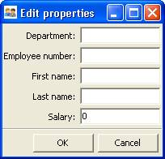
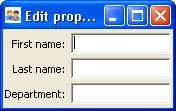

.. _the-view-and-its-building-blocks:

================================
The View and Its Building Blocks
================================

A simple way to edit (or simply observe) the attribute values of a
:term:`HasTraits` object in a GUI window is to call the object's
configure_traits() [3]_ method. This method constructs and displays a window
containing editable fields for each of the object's :term:`trait attribute`\ s.
For example, the following sample code [4]_ defines the SimpleEmployee class,
creates an object of that class, and constructs and displays a GUI for the
object:

.. _example-1-using-configure-traits:

.. rubric:: Example 1: Using configure_traits()

::

    # configure_traits.py -- Sample code to demonstrate 
    #                        configure_traits()
    from enthought.traits.api import HasTraits, Str, Int
    import enthought.traits.ui
    
    class SimpleEmployee(HasTraits):
        first_name = Str
        last_name = Str
        department = Str
    
        employee_number = Str
        salary = Int
    
    sam = SimpleEmployee()
    sam.configure_traits()    

Unfortunately, the resulting form simply displays the attributes of the object
**sam** in alphabetical order with little formatting, which is seldom what is
wanted:


   
   Figure 1: User interface for Example 1

.. _the-view-object:

The View Object
---------------
 
In order to control the layout of the interface, it is necessary to define a
View object. A View object is a template for a GUI window or panel. In other
words, a View specifies the content and appearance of a Traits UI window or
panel display.

For example, suppose you want to construct a GUI window that shows only the
first three attributes of a SimpleEmployee (e.g., because salary is confidential
and the employee number should not be edited). Furthermore, you would like to
specify the order in which those fields appear. You can do this by defining a
View object and passing it to the configure_traits() method:

.. _example-2-using-configure-traits-with-a-view-object:

.. rubric:: Example 2: Using configure_traits() with a View object

::

    # configure_traits_view.py -- Sample code to demonstrate 
    #                             configure_traits()
    
    from enthought.traits.api import HasTraits, Str, Int
    from enthought.traits.ui.api import View, Item
    import enthought.traits.ui
    
    class SimpleEmployee(HasTraits):
        first_name = Str
        last_name = Str
        department = Str
        employee_number = Str
        salary = Int
    
    view1 = View(Item(name = 'first_name'),
                 Item(name = 'last_name'),
                 Item(name = 'department'))
    
    sam = SimpleEmployee()
    sam.configure_traits(view=view1)    

The resulting window has the desired appearance:


   
   Figure 2: User interface for Example 2

The sections on :ref:`contents-of-a-view` through :ref:`advanced-view-concepts`
explore the contents and capabilities of Views. Refer to
the *Traits API Reference* for details of the View class.

Except as noted, all example code uses the configure_traits() method; a detailed
description of this and other techniques for creating GUI displays from Views
can be found in :ref:`displaying-a-view`.

.. _contents-of-a-view:

Contents of a View
------------------
 
The contents of a View are specified primarily in terms of two basic building
blocks: Item objects (which, as suggested by Example 2, correspond roughly to
individual trait attributes), and Group objects. A given View definition can
contain one or more objects of either of these types, which are specified as
arguments to the View constructor, as in the case of the three Items in Example
2.

The remainder of this chapter describes the Item and Group classes. 

.. _the-item-object:

The Item Object
```````````````
 
The simplest building block of a View is the :term:`Item` object. An Item
specifies a single interface :term:`widget`, usually the display for a single
trait attribute of a HasTraits object. The content, appearance, and behavior of
the widget are controlled by means of the Item object's attributes, which are
usually specified as keyword arguments to the Item constructor, as in the case
of *name* in Example 2.

The remainder of this section describes the attributes of the Item object,
grouped by categories of functionality. It is not necessary to understand all of
these attributes in order to create useful Items; many of them can usually be
left unspecified, as their default values are adequate for most purposes.
Indeed, as demonstrated by earlier examples, simply specifying the name of the
trait attribute to be displayed is often enough to produce a usable result.

The following table lists the attributes of the Item class, organized by
functional categories. Refer to the *Traits API Reference* for details on the
Item class.

.. _attributes-of-item-by-category-table:

.. rubric:: Attributes of Item, by category

+----------+---------------------+---------------------------------------------+
|Category  |Attributes           |Description                                  |
+==========+=====================+=============================================+
|Content   | * **name**          |These attributes specify the actual data to  |
|          |                     |be displayed by an item. Because an Item is  |
|          |                     |essentially a template for displaying a      |
|          |                     |single trait, its **name** attribute is      |
|          |                     |nearly always specified.                     |
+----------+---------------------+---------------------------------------------+
|Display   |* **label**          |In addition to specifying which trait        |
|format    |* **resizable**      |attributes are to be displayed, you might    |
|          |* **emphasized**     |need to adjust the format of one or more of  |
|          |* **padding**        |the resulting widgets.                       |
|          |* **height**         |                                             |
|          |* **width**          |If an Item's **label** attribute is specified|
|          |* **dock**           |but not its name, the value of  **label** is |
|          |* **image**          |displayed as a simple, non-editable string.  | 
|          |* **item_theme**     |(This feature can be useful for displaying   |
|          |* **label_theme**    |comments or instructions in a Traits UI      |
|          |* **export**         |window.)                                     |
|          |* **show_label**     |                                             |
|          |* **resizable**      |                                             |
|          |* **springy**        |                                             |
|          |* **emphasized**     |                                             |
+----------+---------------------+---------------------------------------------+
|Content   |* **format_str**     |In some cases it can be desirable to apply   |
|format    |* **format_func**    |special formatting to a widget's contents    |
|          |                     |rather than to the widget itself. Examples of|
|          |                     |such formatting might include rounding a     |
|          |                     |floating-point value to two decimal places,  |
|          |                     |or capitalizing all letter characters in a   |
|          |                     |license plate number.                        |
+----------+---------------------+---------------------------------------------+
|Widget    |* **editor**         |These attributes override the widget that is |
|override  |* **style**          |automatically selected by Traits UI. These   |
|          |                     |options are discussed in                     |
|          |                     |:ref:`introduction-to-trait-editor-factories`|
|          |                     |and                                          |
|          |                     |:ref:`the-predefined-trait-editor-factories`.|
+----------+---------------------+---------------------------------------------+
|Visibility|* **enabled_when**   |Use these attributes to create a simple form |
|and status|* **visible_when**   |of a dynamic GUI, which alters the display   |
|          |* **defined_when**   |in response to changes in the data it        |
|          |* **has_focus**      |contains. More sophisticated dynamic behavior|
|          |                     |can be implemented using a custom            |
|          |.. TODO: Add examples|:term:`Handler` see                          |
|          |   here              |:ref:`controlling-the-interface-the-handler` |
|          |                     |).                                           |
+----------+---------------------+---------------------------------------------+
|User help |* **tooltip**        |These attributes provide guidance to the user|
|          |* **help**           |in using the user interface. If the **help** |
|          |* **help_id**        |attribute is not defined for an Item, a      |
|          |                     |system-generated message is used instead. The|
|          |.. TODO: Add sample  |**help_id** attribute is ignored by the      |
|          |   help screen       |default help handler, but can be used by a   |
|          |                     |custom help handler.                         |
+----------+---------------------+---------------------------------------------+
|Unique    |* **id**             |The **id** attribute is used as a key for    |
|identifier|                     |saving user preferences about the widget. If |
|          |                     |**id** is not specified, the value of the    |
|          |                     |**name** attribute is used.                  |
+----------+---------------------+---------------------------------------------+

.. _subclasses-of-item:

Subclasses of Item
``````````````````
 
The Traits UI package defines the following subclasses of Item:

* Label
* Heading
* Spring

These classes are intended to help with the layout of a Traits UI View, and need
not have a trait attribute associated with them. See the *Traits API Reference*
for details.

.. _the-group-object:

The Group Object
````````````````
 
The preceding sections have shown how to construct windows that display a simple
vertical sequence of widgets using instances of the View and Item classes. For
more sophisticated interfaces, though, it is often desirable to treat a group of
data elements as a unit for reasons that might be visual (e.g., placing the
widgets within a labeled border) or logical (activating or deactivating the
widgets in response to a single condition, defining group-level help text). In
Traits UI, such grouping is accomplished by means of the :term:`Group` object.

Consider the following enhancement to Example 2:

.. _example-3-using-configure-traits-with-a-view-and-a-group-object:

.. rubric:: Example 3: Using configure_traits() with a View and a Group object

::

    # configure_traits_view_group.py -- Sample code to demonstrate 
    #                                   configure_traits()
    from enthought.traits.api import HasTraits, Str, Int
    from enthought.traits.ui.api import View, Item, Group
    import enthought.traits.ui
    
    class SimpleEmployee(HasTraits):
        first_name = Str
        last_name = Str
        department = Str
    
        employee_number = Str
        salary = Int
    
    view1 = View(Group(Item(name = 'first_name'),
                       Item(name = 'last_name'),
                       Item(name = 'department'),
                       label = 'Personnel profile',
                       show_border = True))
    
    sam = SimpleEmployee()
    sam.configure_traits(view=view1)    

The resulting window shows the same widgets as before, but they are now enclosed
in a visible border with a text label:

.. figure:: images/ui_for_ex3.jpg
   :alt: User interface showing three fields enclosed in a border
   
   Figure 3: User interface for Example 3

.. _content-of-a-group:

Content of a Group
::::::::::::::::::
 
The content of a Group object is specified exactly like that of a View object.
In other words, one or more Item or Group objects are given as arguments to the
Group constructor, e.g., the three Items in Example 3. [5]_ The objects
contained in a Group are called the *elements* of that Group. Groups can be
nested to any level.

.. _group-attributes:

Group Attributes
::::::::::::::::
 
The following table lists the attributes of the Group class, organized by 
functional categories. As with Item attributes, many of these attributes can 
be left unspecified for any given Group, as the default values usually lead to
acceptable displays and behavior. 

See the *Traits API Reference* for details of the Group class.

.. _attributes-of-group-by-category-table:

.. rubric:: Attributes of Group, by category

+----------+---------------------+---------------------------------------------+
|Category  |Attributes           |Description                                  |
+==========+=====================+=============================================+
|Content   |* **object**         |The **object** attribute references the      |
|          |* **content**        |object whose traits are being edited by      |
|          |                     |members of the group; by default this is     |
|          |                     |'object', but could be another object in the |
|          |                     |current context. The **content** attribute is|
|          |                     |a list of elements in the group.             |
+----------+---------------------+---------------------------------------------+
|Display   |* **label**          |These attributes define display options for  |
|format    |* **show_border**    |the group as a whole.                        |       
|          |* **show_labels**    |                                             |
|          |* **show_left**      |                                             |
|          |* **padding**        |                                             |
|          |* **layout**         |                                             |
|          |* **selected**       |                                             |
|          |* **orientation**    |                                             |
|          |* **style**          |                                             |
|          |* **columns**        |                                             |
|          |* **dock**           |                                             |
|          |* **dock_theme**     |                                             |
|          |* **group_theme**    |                                             |
|          |* **item_theme**     |                                             |
|          |* **label_theme**    |                                             |
|          |* **image**          |                                             |
|          |* **export**         |                                             |
|          |* **springy**        |                                             |
+----------+---------------------+---------------------------------------------+
|Visibility|* **enabled_when**   |These attributes work similarly to the       |
|and status|* **visible_when**   |attributes of the same names on the Item     |
|          |* **defined_when**   |class.                                       |
|          |                     |                                             |
|          |                     |.. TODO: Does Item-level or Group-level take |
|          |                     |   precedence? Find out and document.        |
+----------+---------------------+---------------------------------------------+
|User help |* **help**           |The help text is used by the default help    |
|          |* **help_id**        |handler only if the group is the only        |
|          |                     |top-level group for the current View. For    |
|          |                     |example, suppose help text is defined for a  |
|          |                     |Group called **group1**. The following View  |
|          |                     |shows this text in its help window::         |
|          |                     |                                             |
|          |                     |  View(group1)                               |
|          |                     |                                             |
|          |                     |The following two do  not::                  |
|          |                     |                                             |
|          |                     |  View(group1, group2)                       |
|          |                     |  View(Group(group1))                        |
|          |                     |                                             |
|          |                     |The **help_id** attribute is ignored by the  |
|          |                     |default help handler, but can be used by a   |
|          |                     |custom help handler.                         |
|          |                     |                                             |
|          |                     |.. TODO: The document needs to include       |
|          |                     |   material on organizing Views via Groups,  |
|          |                     |   including the implied top-level group of  |
|          |                     |   every View. If we do this earlier in the  |
|          |                     |   document, it will probably simplify this. |
+----------+---------------------+---------------------------------------------+
|Unique    |* **id**             |The **id** attribute is used as a key for    |
|identifier|                     |saving user preferences about the widget. If |
|          |                     |**id** is not specified, the **id** values   |
|          |                     |of the elements of the group are concatenated|
|          |                     |and used as the group identifier.            |
+----------+---------------------+---------------------------------------------+

.. _subclasses-of-group:

Subclasses of Group
```````````````````
 
The Traits UI package defines the following subclasses of Group, which are
helpful shorthands for defining certain types of groups. Refer to the *Traits
API Reference* for details.

.. _subclasses-of-group_table:

.. rubric:: Subclasses of Group

+-----------+------------------------------+-----------------------------------+
|Subclass   |Description                   |Equivalent To                      |
+===========+==============================+===================================+
|HGroup     |A group whose items are laid  |:samp:`Group(orientation=          |
|           |out horizontally.             |'horizontal')`                     |
+-----------+------------------------------+-----------------------------------+
|HFlow      |A horizontal group whose items|:samp:`Group(orientation=          |
|           |"wrap" when they exceed the   |'horizontal, layout='flow',        |
|           |available horizontal space.   |show_labels=False)`                |
+-----------+------------------------------+-----------------------------------+
|HSplit     |A horizontal group with       |:samp:`Group(orientation=          |
|           |splitter bars to separate it  |'horizontal', layout='split')`     |
|           |from other groups.            |                                   |
+-----------+------------------------------+-----------------------------------+
|Tabbed     |A group that is shown as a tab|:samp:`Group(orientation=          |
|           |in a notebook.                |'horizontal', layout='tabbed)`     |
+-----------+------------------------------+-----------------------------------+
|VGroup     |A group whose items are laid  |:samp:`Group(orientation=          |
|           |out vertically.               |'vertical')`                       |
+-----------+------------------------------+-----------------------------------+
|VFlow      |A vertical group whose items  |:samp:`Group(orientation=          |
|           |"wrap" when they exceed the   |'vertical', layout='flow',         |
|           |available vertical space.     |show_labels=False)`                |
+-----------+------------------------------+-----------------------------------+
|VFold      |A vertical group in which     |:samp:`Group(orientation=          |
|           |items can be collapsed (i.e., |'vertical', layout='fold',         |
|           |folded) by clicking their     |show_labels=False)`                |
|           |titles.                       |                                   |
+-----------+------------------------------+-----------------------------------+
|VGrid      |A vertical group whose items  |:samp:`Group(orientation=          |
|           |are laid out in two columns.  |'vertical', columns=2)`            |
+-----------+------------------------------+-----------------------------------+
|VSplit     |A vertical group with splitter|:samp:`Group(orientation=          |
|           |bars to separate it from other|'vertical', layout='split')`       |
|           |groups.                       |                                   |
+-----------+------------------------------+-----------------------------------+

 
.. rubric:: Footnotes

.. [3] If the code is being run from a program that already has a GUI defined,
   then use edit_traits() instead of configure_traits(). These methods are
   discussed in more detail in Section 4.3.
   
.. [4] All code examples in this guide that include a file name are also
   available as examples in the :file:`tutorials/doc_examples/examples` subdirectory
   of the Traits docs directory. You can run them individually, or view them in
   a tutorial program by running: 
   :program:`python` :file:`{Traits_dir}/tutorials/tutor.py` :file:`{Traits_dir}/docs/tutorials/doc_examples`
   
.. [5] As with Views, it is possible for a Group to contain objects of more than
   one type, but it is not recommended.
