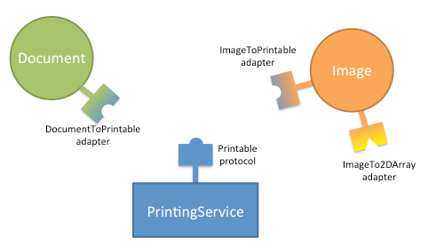

.. _advanced-topics:

===============
Advanced Topics
===============

The preceding sections provide enough information for you to use traits for
manifestly-typed attributes, with initialization and validation. This section
describes the advanced features of the Traits package

.. _initialization-and-validation-revisited:

Initialization and Validation Revisited
---------------------------------------

The following sections present advanced topics related to the initialization and
validation features of the Traits package.

* Dynamic initialization
* Overriding default values
* Reusing trait definitions
* Trait attribute definition strategies

.. index:: initialization; dynamic

.. _dynamic-initialization:

Dynamic Initialization
``````````````````````

When you define trait attributes using predefined traits, the Trait() factory
function or trait handlers, you typically specify their default values
statically. You can also define a method that dynamically initializes a trait
attribute. To do this, you define a method on the same class as the trait
attribute, with a name based on the name of the trait attribute:

.. index:: default value; method

.. method:: _name_default()

This method returns the default value for the *name* trait attribute and it
overrides any default value specified in the trait definition.

Similar to static default values, default values defined dynamically should be
thought of as existing **prior to** setting object state during
initialization. For performance purposes, a default initializer method is
called when:

1. the attribute value is accessed the first time or
2. an instance is constructed with a specific value, if there is a change
   handler defined for the trait. This is needed so the default can be reported
   as the old value (see :ref:`static-notification`).

While it is possible to use a default initializer method to lazily initialize
attributes based on the object state post-instantiation, this relies on not
having to observe for changes on the trait. This is often difficult in
practice, since trait notifications can be set up by external objects, and are
often needed for Property traits, delegation and GUI applications. These use
cases may cause the default values to be computed eagerly prior to
instantiation, instead of lazily after instantiation.

.. index:: get_default_value()

It is also possible to define a dynamic method for the default value in a trait
type subclass (get_default_value()). However, using a
_\ *name*\ _default()  method avoids the overhead of subclassing a trait.

.. index:: default value; overriding in a subclass
.. index::
   pair: examples; overriding default values

.. _overriding-default-values-in-a-subclass:

Overriding Default Values in a Subclass
```````````````````````````````````````

Often, a subclass must override a trait attribute in a parent class by providing
a different default value. You can specify a new default value without
completely re-specifying the trait definition for the attribute. For example::

    # override_default.py -- Example of overriding a default value for
    #                        a trait attribute in a subclass
    from traits.api import HasTraits, Range, Str

    class Employee(HasTraits):
        name = Str
        salary_grade = Range(value=1, low=1, high=10)

    class Manager(Employee):
        salary_grade = 5

In this example, the **salary_grade** of the Employee class is a range from 1 to
10, with a default value of 1. In the Manager subclass, the default value of
**salary_grade** is 5, but it is still a range as defined in the Employee class.

.. index:: trait; definitions; reusing

.. _reusing-trait-definitions:

Reusing Trait Definitions
`````````````````````````

As mentioned in :ref:`defining-traits-initialization-and-validation`, in most
cases, traits are defined in-line in attribute definitions, but they can also be
defined independently. A trait definition only describes the characteristics of
a trait, and not the current value of a trait attribute, so it can be used in
the definition of any number of attributes. For example::

    # trait_reuse.py --- Example of reusing trait definitions
    from traits.api import HasTraits, Range

    coefficient = Range(-1.0, 1.0, 0.0))

    class quadratic(HasTraits):
        c2 = coefficient
        c1 = coefficient
        c0 = coefficient
        x  = Range(-100.0, 100.0, 0.0)

In this example, a trait named **coefficient** is defined externally to the
class **quadratic**, which references **coefficient** in the definitions of its
trait attributes **c2**, **c1**, and **c0**. Each of these attributes has a
unique value, but they all use the same trait definition to determine whether a
value assigned to them is valid.

.. index:: explicit trait attribute definition

.. _trait-attribute-definition-strategies:

Trait Attribute Definition Strategies
`````````````````````````````````````

In the preceding examples in this guide, all trait attribute definitions have
bound a single object attribute to a specified trait definition. This is known
as "explicit" trait attribute definition. The Traits package supports other
strategies for defining trait attributes. You can associate a category of
attributes with a particular trait definition, using the trait attribute name
wildcard. You can also dynamically create trait attributes that are specific to
an instance, using the add_trait() method, rather than defined on a class. These
strategies are described in the following sections.

.. index:: wildcard; trait attribute names
   pair: wildcard; examples

.. _trait-attribute-name-wildcard:

Trait Attribute Name Wildcard
:::::::::::::::::::::::::::::

The Traits package enables you to define a category of trait attributes
associated with a particular trait definition, by including an underscore ('_')
as a wildcard at the end of a trait attribute name. For example::

    # temp_wildcard.py --- Example of using a wildcard with a Trait
    #                      attribute name
    from traits.api import Any, HasTraits

    class Person(HasTraits):
        temp_ = Any

This example defines a class Person, with a category of attributes that have
names beginning with ``temp``, and that are defined by the Any trait. Thus, any
part of the program that uses a Person instance can reference attributes such as
**tempCount**, **temp_name**, or **temp_whatever**, without having to explicitly
declare these trait attributes. Each such attribute has None as the initial
value and allows assignment of any value (because it is based on the Any trait).

You can even give all object attributes a default trait definition, by
specifying only the wildcard character for the attribute name::

    # all_wildcard.py --- Example of trait attribute wildcard rules
    from traits.api import Any, HasTraits, Int, Str

    class Person ( HasTraits ):

        # Normal, explicitly defined trait:
        name = Str

        # By default, let all traits have any value:
        _ = Any

        # Except for this one, which must be an Int:
        age = Int
    """
    >>> bill = Person()
    >>> # These assignments should all work:
    >>> bill.name      = 'William'
    >>> bill.address  = '121 Drury Lane'
    >>> bill.zip_code = 55212
    >>> bill.age      = 49
    >>> # This should generate an error (must be an Int):
    >>> bill.age = 'middle age'
    Traceback (most recent call last):
      File "all_wildcard.py", line 33, in <module>
        bill.age = 'middle age'
      File "c:\wrk\src\lib\enthought\traits\\trait_handlers.py", line 163, in error
        raise TraitError( object, name, self.info(), value )
    TraitError: The 'age' trait of a Person instance must be an integer, but a value
     of 'middle age' <type 'str'> was specified.
    """

In this case, all Person instance attributes can be created on the fly and are
defined by the Any trait.

.. index:: wildard; rules

.. _wildcard-rules:

Wildcard Rules
''''''''''''''

When using wildcard characters in trait attribute names, the following rules are
used to determine what trait definition governs an attribute:

1. If an attribute name exactly matches a name without a wildcard character,
   that definition applies.
2. Otherwise, if an attribute name matches one or more names with wildcard
   characters, the definition with the longest name applies.

Note that all possible attribute names are covered by one of these two rules.
The base HasTraits class implicitly contains the attribute definition
``_ = Python``. This rule guarantees that, by default, all attributes have
standard Python language semantics.

These rules are demonstrated by the following example::

    # wildcard_rules.py -- Example of trait attribute wildcard rules
    from traits.api import Any, HasTraits, Int, Python

    class Person(HasTraits):
        temp_count = Int(-1)
        temp_      = Any
        _          = Python

In this example, the Person class has a **temp_count** attribute, which must be
an integer and which has an initial value of -1. Any other attribute with a name
starting with ``temp`` has an initial value of None and allows any value to be
assigned. All other object attributes behave like normal Python attributes
(i.e., they allow any value to be assigned, but they must have a value assigned
to them before their first reference).

.. index:: Disallow; object, examples; Disallow object

.. _disallow-object:

Disallow Object
'''''''''''''''

The singleton object Disallow can be used with wildcards to disallow all
attributes that are not explicitly defined. For example::

    # disallow.py --- Example of using Disallow with wildcards
    from traits.api import \
        Disallow, Float, HasTraits, Int, Str

    class Person (HasTraits):
        name   = Str
        age    = Int
        weight = Float
        _      = Disallow

In this example, a Person instance has three trait attributes:

* **name**: Must be a string; its initial value is ''.
* **age**: Must be an integer; its initial value is 0.
* **weight**: Must be a float; its initial value is 0.0.

All other object attributes are explicitly disallowed. That is, any attempt to
read or set any object attribute other than **name**, **age**, or **weight**
causes an exception.

.. index:: HasTraits class; predefined subclasses

.. _hastraits-subclasses:

HasTraits Subclasses
''''''''''''''''''''

Because the HasTraits class implicitly contains the attribute definition
``_ = Python``, subclasses of HasTraits by default have very standard Python
attribute behavior for any attribute not explicitly defined as a trait
attribute. However, the wildcard trait attribute definition rules make it easy
to create subclasses of HasTraits with very non-standard attribute behavior. Two
such subclasses are predefined in the Traits package: HasStrictTraits and
HasPrivateTraits.

.. index:: HasStrictTraits class

.. _hasstricttraits:

HasStrictTraits
'''''''''''''''

This class guarantees that accessing any object attribute that does not have an
explicit or wildcard trait definition results in an exception. This can be
useful in cases where a more rigorous software engineering approach is employed
than is typical for Python programs. It also helps prevent typos and spelling
mistakes in attribute names from going unnoticed; a misspelled attribute name
typically causes an exception. The definition of HasStrictTraits is the
following::

    class HasStrictTraits(HasTraits):
          _ = Disallow

HasStrictTraits can be used to create type-checked data structures, as in the
following example::

   class TreeNode(HasStrictTraits):
       left = This
       right = This
       value = Str

This example defines a TreeNode class that has three attributes: **left**,
**right**, and **value**. The **left** and **right** attributes can only be
references to other instances of TreeNode (or subclasses), while the **value**
attribute must be a string. Attempting to set other types of values generates an
exception, as does attempting to set an attribute that is not one of the three
defined attributes. In essence, TreeNode behaves like a type-checked data
structure.

.. index:: HasRequiredTraits class

.. _hasrequiredtraits:

HasRequiredTraits
'''''''''''''''''

This subclass of :ref:`hasstricttraits` ensures that any object attribute with
``required=True`` in its metadata must be passed as an argument on object
initialization.

An example of a class with required traits::

    class RequiredTest(HasRequiredTraits):
        required_trait = Any(required=True)
        non_required_trait = Any()

All required traits have to be provided as arguments on creating a new
instance::

    >>> new_instance = RequiredTest(required_trait=13.0)

Non-required traits can also still be provided as usual::

    >>> new_instance = RequiredTest(required_trait=13.0, non_required_trait=14.0)

However, omitting a required trait will raise a TraitError::

    >>> new_instance = RequiredTest(non_required_trait=14.0)
    traits.trait_errors.TraitError: The following required traits were not
    provided: required_trait.

.. index:: HasPrivateTraits class

.. _hasprivatetraits:

HasPrivateTraits
''''''''''''''''

This class is similar to HasStrictTraits, but allows attributes beginning with
'_' to have an initial value of None, and to not be type-checked. This is useful
in cases where a class needs private attributes, which are not part of the
class's public API, to keep track of internal object state. Such attributes do
not need to be type-checked because they are only manipulated by the (presumably
correct) methods of the class itself. The definition of HasPrivateTraits is the
following::

    class HasPrivateTraits(HasTraits):
          __ = Any
          _  = Disallow

These subclasses of HasTraits are provided as a convenience, and their use is
completely optional. However, they do illustrate how easy it is to create
subclasses with customized default attribute behavior if desired.

.. index:: trait attributes; per-object

.. _per-object-trait-attributes:

Per-Object Trait Attributes
'''''''''''''''''''''''''''

The Traits package allows you to define dynamic trait attributes that are
object-, rather than class-, specific. This is accomplished using the
add_trait() method of the HasTraits class:

.. method:: add_trait(name, trait)

.. index:: examples; per-object trait attributes

For example::

    # object_trait_attrs.py --- Example of per-object trait attributes
    from traits.api import HasTraits, Range

    class GUISlider (HasTraits):

        def __init__(self, eval=None, label='Value',
                     trait=None, min=0.0, max=1.0,
                     initial=None, **traits):
            HasTraits.__init__(self, **traits)
            if trait is None:
                if min > max:
                    min, max = max, min
                if initial is None:
                    initial = min
                elif not (min <= initial <= max):
                    initial = [min, max][
                                abs(initial - min) >
                                abs(initial - max)]
                trait = Range(min, max, value = initial)
            self.add_trait(label, trait)

This example creates a GUISlider class, whose __init__() method can accept a
string label and either a trait definition or minimum, maximum, and initial
values. If no trait definition is specified, one is constructed based on the
**max** and **min** values. A trait attribute whose name is the value of label
is added to the object, using the trait definition (whether specified or
constructed). Thus, the label trait attribute on the GUISlider object is
determined by the calling code, and added in the __init__() method using
add_trait().

You can require that add_trait() must be used in order to add attributes to a
class, by deriving the class from HasStrictTraits (see :ref:`hasstricttraits`).
When a class inherits from HasStrictTraits, the program cannot create a new
attribute (either a trait attribute or a regular attribute) simply by assigning
to it, as is normally the case in Python. In this case, add_trait() is the only
way to create a new attribute for the class outside of the class definition.


.. index:: interfaces

.. _interfaces:

Interfaces
----------

The Traits package supports declaring and implementing
*interfaces*. An interface is an abstract data type that defines a set of
attributes and methods that an object must have to work in a given situation.
The interface says nothing about what the attributes or methods do, or how they
do it; it just says that they have to be there. Interfaces in Traits are similar
to those in Java. They can be used to declare a relationship among classes which
have similar behavior but do not have an inheritance relationship. Like Traits
in general, Traits interfaces don't make anything possible that is not already
possible in Python, but they can make relationships more explicit and enforced.
Python programmers routinely use implicit, informal interfaces (what's known as
"duck typing"). Traits allows programmers to define explicit and formal
interfaces, so that programmers reading the code can more easily understand what
kinds of objects are actually *intended* to be used in a given situation.

.. index:: interfaces; defining, examples; interface definition

.. _defining-an-interface:

Defining an Interface
`````````````````````

To define an interface, create a subclass of Interface::

    from traits.api import Interface

    class IName(Interface):

        def get_name(self):
            """ Returns a string which is the name of an object. """

Interface classes serve primarily as documentation of the methods and
attributes that the interface defines. In this case, a class that implements the
``IName`` interface must have a method named ``get_name()``, which takes no arguments
and returns a string. Do not include any implementation code in an interface
declaration. However, the Traits package does not actually check to ensure that
interfaces do not contain implementations.

By convention, interface names have a capital 'I' at the beginning of the name.

.. index:: interfaces; implementing

.. _implementing-an-interface:

Implementing an Interface
`````````````````````````

A class declares that it implements one or more interfaces using the
:func:`~traits.api.provides` class decorator, which has the signature:

.. currentmodule:: traits.has_traits
.. function:: provides(interface[, interface2 , ... , interfaceN])
    :noindex:

.. index:: examples; interface implementation, interfaces; implementation; example

Interface names beyond the first one are optional. As for all class
decorators, the call to provides must occur just before the class
definition. For example::

    from traits.api import HasTraits, Interface, provides, Str

    class IName(Interface):
        def get_name(self):
            """ Returns a string which is the name of an object. """

    @provides(IName)
    class Person(HasTraits):

        first_name = Str( 'John' )
        last_name  = Str( 'Doe' )

        # Implementation of the 'IName' interface:
        def get_name ( self ):
            ''' Returns the name of an object. '''
            name = '{first} {last}'
            return name.format(name=self.first_name, last=self.last_name)

You can specify whether the provides() decorator verifies that
the class calling it actually implements the interface that it says it does.
This is determined by the CHECK_INTERFACES variable, which can take one of three
values:

* 0 (default): Does not check whether classes implement their declared interfaces.
* 1: Verifies that classes implement the interfaces they say they do, and logs
  a warning if they don't.
* 2: Verifies that classes implement the interfaces they say they do, and raises
  an InterfaceError if they don't.

The CHECK_INTERFACES variable must be imported directly from the
traits.has_traits module::

    import traits.has_traits
    traits.has_traits.CHECK_INTERFACES = 1

.. deprecated:: 6.2.0
   Interface checking with the ``@provides`` decorator is deprecated. In the
   future, the ``@provides`` decorator will ignore the value of
   ``CHECK_INTERFACES`` and will not do any interface checking.

.. index:: interfaces; using, examples; interface usage

.. _using-interfaces:

Using Interfaces
````````````````

You can use an interface at any place where you would normally use a class name.
The most common way to use interfaces is with the
:class:`~traits.trait_types.Instance` or
:class:`~traits.trait_types.Supports` traits::

    >>> from traits.api import HasTraits, Instance
    >>> class Apartment(HasTraits):
    ...     renter = Instance(IName)
    >>> william = Person(first_name='William', last_name='Adams')
    >>> apt1 = Apartment( renter=william )
    >>> print 'Renter is: ', apt1.renter.get_name()
    Renter is: William Adams

Using an interface class with an ``Instance`` trait definition declares that the
trait accepts only values that implement the specified interface. Using the
``Supports`` traits, if the assigned object does not implement the interface,
the Traits package may automatically substitute an adapter object that
implements the specified interface. See :ref:`adaptation` for more
information.

.. index:: adaptation

.. _adaptation:

Adaptation
----------

*The adaptation features of Traits have been rewritten in v. 4.4.0 . See
the* :ref:`migration guide <migration>` *below for details regarding changes
in API.*

Adaptation is the process of transforming an object that does not implement a
specific interface needed by a client into an object that does. In the adapter
pattern, an object is wrapped in a second object, the *adapter*,
that implements the target interface.

Adaptation enables a programming style in which each component or service in an
application defines an interface through which it would like to receive
information. Objects that need to communicate with the component declare
an adapter for that interface, as illustrated in the figure below.



Adaptation allows decoupling the data model from the application components and
services: introducing a new component in the application should not require
modifying the data objects!

Traits provides a package to make this pattern easy and automatic:
In the :mod:`traits.adaptation` package, adapters from a protocol
(type or interface) to another can be registered with a manager object.
HasTraits classes can either explicitly request to adapt an object to a
protocol, or they can define special traits that automatically invoke
the adaptation manager whenever it is necessary.

For example, if a :class:`~traits.trait_types.Supports` trait requires
its values to implement
interface ``IPrintable``, and an object is assigned to it which is of
class ``Image``, which does not implement ``IPrintable``, then Traits looks for
an adapter from ``Image`` to ``IPrintable``, and if one exists the adapter object
is assigned to the trait. If necessary, a "chain" of adapter objects might be
created, in order to perform the required adaptation.

Main features
`````````````

The main features of the :mod:`traits.adaptation` package are:

* Support for Python classes, ABCs, and traits :class:`~.Interface` s

   Protocols can be specified using any of those.

* Chaining of adapters

   Adapters can be chained, i.e., an object can be adapted
   to a target protocol as long as there is a sequence of adapters
   that can be used to transform it.

* Conditional adaptation

   Adaptation of an object to a protocol can be conditional, i.e. it may
   succeed or fail depending on the state of the object.

* Lazy loading

   The classes for the adapter, the origin, and the target protocols can
   be specified as strings, and are only loaded if they are required.

Note on terminology
```````````````````

To avoid confusion, let's define two terms that we will use all the time:

* We say that a class *provides* a protocol if it is a subclass of the
  protocol, or if it implements the protocol (if it is an interface)

* We say that a class *supports* a protocol if it provides the protocol
  or an adapter object can be built that provides the protocol

.. index:: adapters; defining

.. _defining-adapters:

Defining Adapters
`````````````````

.. index:: Adapter class

.. _subclassing-adapter:

The :class:`Adapter` class
::::::::::::::::::::::::::

The Traits package provides two classes for defining adapters,
one for Traits adapters, :class:`~traits.adaptation.adapter.Adapter`,
and one for for pure-Python adapters,
:class:`~traits.adaptation.adapter.PurePythonAdapter`. These classes
streamline the process of creating a new adapter class. They have a standard
constructor that does not normally need to be overridden by subclasses. This
constructor accepts one parameter, which is the object to be adapted, and
assigns that object to an :attr:`adaptee` attribute (a trait in the case
of :class:`~traits.adaptation.adapter.Adapter`).

As an adapter writer, you need to take care of the following:

* Declare which interfaces the adapter class implements on behalf of the
  object it is adapting. For example, if we are working with Traits
  :class:`~.Interface` s, the adapter would be decorated with the
  :func:`~traits.has_traits.provides` decorator. In the case of Python ABCs,
  the class would be a subclass of the abstract base class, or be
  `registered with it
  <http://docs.python.org/2/library/abc.html#abc.ABCMeta.register>`_.

* Implement the methods defined in the interfaces declared in the previous
  step. Usually, these methods are implemented using appropriate members
  on the adaptee object.

.. index:: adaptee trait

* For Traits adapters, define a trait attribute named **adaptee** that
  declares what type of object it is an adapter for. Usually, this is an
  :class:`~.Instance` trait.

.. index::
   pair: example; Adapter class

The following code example shows a definition of a simple adapter class::

    from traits.api import Adapter, Instance, provides

    # Declare what interfaces this adapter implements for its client
    @provides(IName)
    class PersonToIName(Adapter):

        # Declare the type of client it supports:
        adaptee = Instance(Person)

        # Implement the 'IName' interface on behalf of its client:
        def get_name ( self ):
            name = '{first} {last}'.format(first=self.adaptee.first_name,
                                           last=self.adaptee.last_name)
            return name

.. index::
   pair: registering; adapters

.. _registering-adapters:

Registering adapters
::::::::::::::::::::

Once an adapter class has been defined, it has to be registered with the
adaptation manager using the :func:`~traits.adaptation.api.register_factory`
function.

The signature of :func:`~traits.adaptation.api.register_factory` is:

.. currentmodule:: traits.adaptation.api
.. function:: register_factory(adapter_class, from_protocol, to_protocol)
    :noindex:

The :func:`~traits.adaptation.adaptation_manager.register_factory` function
takes as first argument
the adapter class (or an :ref:`adapter factory <adapter-factories>`), followed
by the protocol to be adapted (the one provided by the adaptee,
:attr:`from_protocol`), and the protocol that it provides
(:attr:`to_protocol`).

.. index:: examples; registering adapters

This is the example from the previous section, were the adapter is registered::

    from traits.adaptation.api import Adapter, Instance, provides

    # Declare what interfaces this adapter implements for its client
    @provides(IName)
    class PersonToIName(Adapter):

        # Declare the type of client it supports:
        adaptee = Instance(Person)

        # Implement the 'IName' interface on behalf of its client:
        def get_name ( self ):
            name = '{first} {last}'.format(first=self.adaptee.first_name,
                                           last=self.adaptee.last_name)
            return name

    # ... somewhere else at application startup.
    register_factory(PersonToIName, Person, IName)

.. index:: adapters; factory; factories; conditional adaptation

.. _adapter-factories:

Adapter factories, and conditional adaptation
`````````````````````````````````````````````

The first argument to the :func:`~traits.adaptation.api.register_factory`
function needs not be an adapter *class*, it can be, more generally, an
adapter *factory*.

An adapter factory can be any callable that accepts one positional argument,
the adaptee object, and returns an adapter or None if the adaptation was
not possible. Adapter factories allow flexibility in the adaptation process,
as the result of adaptation may vary depending on the state of the
adaptee object.


.. _conditional-adaptation:

Conditional adaptation
::::::::::::::::::::::

A common use of adapter factories is to allow adaptation only if the
state of the adaptee object allows it. The factory returns an adapter object
if adaptation is possible, or None if it is not.

In the following example, a ``numpy.ndarray`` object can be adapted to provide
an ``IImage`` protocol only if the number of dimensions is 2. (For
illustration, this example uses Python ABCs rather than Traits Interfaces.)
::

    import abc
    import numpy
    from traits.api import Array, HasTraits
    from traits.adaptation.api import adapt, Adapter, register_factory

    class ImageABC(object):
        __metaclass__ = abc.ABCMeta

    class NDArrayToImage(Adapter):
        adaptee = Array

    # Declare that NDArrayToImage implements ImageABC.
    ImageABC.register(NDArrayToImage)


    def ndarray_to_image_abc(adaptee):
        """ An adapter factory from numpy arrays to the ImageABC protocol."""
        if adaptee.ndim == 2:
            return NDArrayToImage(adaptee=adaptee)
        return None

    # ... somewhere else at application startup
    register_factory(ndarray_to_image_abc, numpy.ndarray, ImageABC)

    # Try to adapt numpy arrays to images. The `adapt` function is
    # introduced later in the docs, but you can probably guess what it does ;-)

    # This adaptation fails, as the array is 1D
    image = adapt(numpy.ndarray([1,2,3]), ImageABC, default=None)
    assert image == None

    # This succeeds.
    image = adapt(numpy.array([[1,2],[3,4]]), ImageABC)
    assert isinstance(image, NDArrayToImage)

.. index::
  pair: adapters; requesting

.. _using-adapters:

Requesting an adapter
`````````````````````

The ``adapt`` function
::::::::::::::::::::::

Adapter classes are defined as described in the preceding sections, but you do
not explicitly create instances of these classes.

Instead, the function :func:`~traits.adaptation.adaptation_manager.adapt` is
used, giving the object that needs to be adapted and the target protocol.

For instance, in the example in the :ref:`conditional-adaptation` section,
a 2D numpy array is adapted to an ImageABC protocol with
::

    image = adapt(numpy.array([[1,2],[3,4]]), ImageABC)

In some cases, no single adapter class is registered that adapts the object
to the required interface, but a series of adapter classes exist that,
together, perform the required adaptation. In such cases, the necessary set
of adapter objects are created, and the "last" link in the chain, the one
that actually implements the required interface, is returned.

When a situation like this arises, the adapted object assigned to the trait
always contains the smallest set of adapter objects needed to adapt the
original object. Also, more specific adapters are preferred over less specific
ones. For example, let's suppose we have a class ``Document`` and a subclass
``HTMLDocument``. We register two adapters to an interface ``IPrintable``,
``DocumentToIPrintable`` and ``HTMLDocumentToIPrintable``. The call
::

    html_doc = HTMLDocument()
    printable = adapt(html_doc, IPrintable)

will return an instance of the ``HTMLDocumentToIPrintable`` adapter, as it
is more specific than ``DocumentToIPrintable``.

If no single adapter and no adapter chain can be constructed for the requested
adaptation, an :class:`~traits.adaptation.adaptation_error.AdaptationError`
is raised. Alternatively, one can specify a default value to be returned
in this case::

    printable = adapt(unprintable_doc, IPrintable, default=EmptyPrintableDoc())

Using Traits interfaces
:::::::::::::::::::::::

An alternative syntax to create adapters when using Traits Interfaces is
to use the interface class as an adapter factory, for example
::

    printable = IPrintable(html_doc, None)

is equivalent to
::

    printable = adapt(html_doc, IPrintable, default=None)

(the default argument, None, is optional).

Using the ``Supports`` and ``AdaptsTo`` traits
::::::::::::::::::::::::::::::::::::::::::::::

Using the terminology introduced in this section, we can say that the
:class:`~.Instance` trait accepts values that *provide* the specified protocol.

Traits defines two additional traits that accept values that *support* a
given protocol (they provide it or can be adapted to it) instead:

* The :class:`~.Supports` trait accepts values that support the specified
  protocol. The value of the trait after assignment is the possibly adapted
  value (i.e., it is the original assigned value if that provides the protocol,
  or is an adapter otherwise).

* The :class:`~.AdaptsTo` trait also accepts values that support the specified
  protocol. Unlike ``Supports``, ``AdaptsTo`` stores the original, unadapted
  value.

If your application works with adaptation, it is natural to use the
``Supports`` trait in place of the ``Instance`` one in most cases. This
will allow that application to be extended by adaptation in the future
without changing the existing code, without having to invoke adaptation
explicitly in your code.

For example, a Traits object can be written against the ``IPrintable``
interface and be open to extensions by adaptation as follows:
::

    from traits.api import (Adapter, HasTraits, Interface, List, provides,
                            register_factory, Str, Supports)

    class IPrintable(Interface):
        def get_formatted_text(self, n_cols):
            """ Return text formatted with the given number of columns. """

    class PrintQueue(HasTraits):
        # This is the key part of the example: we declare a list of
        # items that provide or can be adapted to IPrintable
        queue = List(Supports(IPrintable))

        def is_empty(self):
            return len(self.queue) == 0

        def push(self, printable):
            self.queue.append(printable)

        def print_next(self):
            printable = self.queue.pop(0)

            # The elements from the list are guaranteed to provide
            # IPrintable, so we can call the interface without worrying
            # about adaptation.
            lines = printable.get_formatted_text(n_cols=20)

            print('-- Start document --')
            print('\n'.join(lines))
            print('-- End of document -\n')

    class TextDocument(HasTraits):
        """ A text document. """
        text = Str

    @provides(IPrintable)
    class TextDocumentToIPrintable(Adapter):
        """ Adapt TextDocument and provide IPrintable. """

        def get_formatted_text(self, n_cols):
            import textwrap
            return textwrap.wrap(self.adaptee.text, n_cols)


    # ---- Application starts here.

    # Register the adapter.
    register_factory(TextDocumentToIPrintable, TextDocument, IPrintable)

    # Create two text documents.
    doc1 = TextDocument(text='very very long text the will bore you for sure')
    doc2 = TextDocument(text='once upon a time in a far away galaxy')

    # The text documents can be pushed on the print queue; in the process,
    # they are automatically adapted by Traits.
    print_queue = PrintQueue()
    print_queue.push(doc1)
    print_queue.push(doc2)

    while not print_queue.is_empty():
        print_queue.print_next()

This scripts produces this output:
::

    -- Start document --
    very very long text
    the will bore you
    for sure
    -- End of document -

    -- Start document --
    once upon a time in
    a far away galaxy
    -- End of document -


Implementation details
``````````````````````

The algorithm for finding a sequence of adapters adapting an object ``adaptee``
to a protocol ``to_protocol`` is based on a weighted graph.

Nodes on the graphs are protocols (types or interfaces).
Edges are adaptation offers that connect a ``offer.from_protocol`` to a
``offer.to_protocol``.

Edges connect protocol ``A`` to protocol ``B`` and are weighted by two
numbers in this priority:

1) a unit weight (1) representing the fact that we use 1 adaptation
   offer to go from ``A`` to ``B``
2) the number of steps up the type hierarchy that we need to take
   to go from ``A`` to ``offer.from_protocol``, so that more specific
   adapters are always preferred

The algorithm finds the shortest weighted path between ``adaptee``
and ``to_protocol``. Once a candidate path is found, it tries to
create the chain of adapters using the factories in the adaptation offers
that compose the path. If this fails because of conditional
adaptation (i.e., an adapter factory returns None), the path
is discarded and the algorithm looks for the next shortest path.

Cycles in adaptation are avoided by only considering path were
every adaptation offer is used at most once.

.. _migration:

Migration guide
```````````````

The implementation of the adaptation mechanism changed in Traits 4.4.0 from
one based on PyProtocols to a new, smaller, and more robust implementation.

Code written against ``traits.protocols`` will not work any longer as the
``traits.protocols`` API has been removed in Traits 5.0.0 .

This is a list of replacements for the old API:

* :class:`traits.protocols.api.AdaptationFailure`

  Use :class:`traits.api.AdaptationError` instead.

* :func:`traits.api.adapts`

  Use the :func:`traits.api.register_factory` function.

* :func:`implements`

  Use the :func:`traits.api.provides` decorator instead.

* :func:`traits.protocols.api.declareAdapter`

  Use the function :func:`traits.api.register_factory`, or the function
  :func:`traits.adaptation.api.register_offer` instead. It is no longer
  necessary to distinguish between "types", "protocols", and "objects".

* :func:`traits.protocols.api.declareImplementation`

  This function
  was used occasionally to declare that an arbitrary type (e.g., ``dict``)
  implements an interface. Users that use Python ABCs can use the ``register``
  method for achieving the same result. Otherwise, use the function
  :func:`traits.adaptation.api.register_provides` that declares a "null"
  adapter to adapt the type to the interface.

* Testing if a class is an Interface

  ``issubclass(klass, Interface)`` is not reliable, use
  :func:`traits.api.isinterface` instead

Gotchas
```````

1) The methods :func:`~traits.adaptation.adaptation_manager.register_factory`,
   :func:`~traits.adaptation.adaptation_manager.adapt`,
   etc. use a global adaptation manager, which is accessible through the
   function
   :func:`~traits.adaptation.adaptation_manager.get_global_adaptation_manager`.
   The traits automatic adaptation features also use the global manager.
   Having a global adaptation manager can get you into trouble, for the usual
   reasons related to having a global state. If you want to have more control
   over adaptation, we recommend creating a new
   :class:`~traits.adaptation.adaptation_manager.AdaptationManager`
   instance, use it directly in your application, and set it as the global
   manager using
   :func:`~traits.adaptation.adaptation_manager.set_global_adaptation_manager`.
   A common issue with the global manager arises in unittesting, where adapters
   registered in one test influence the outcome of other tests downstream.
   Tests relying on adaptation should make sure to reset the state of the
   global adapter using
   :func:`~traits.adaptation.adaptation_manager.reset_global_adaptation_manager`.

Recommended readings about adaptation
`````````````````````````````````````

This is a list of interesting readings about adaptation and the adapter
pattern outside of Traits:

* `PyProtocols <http://peak.telecommunity.com/protocol_ref/module-protocols.html>`_,
  a precursor of ``traits.adaptation``
* `PEP 246 <http://www.python.org/dev/peps/pep-0246/>`_ on object adaptation
* `Article about adapters in Eclipse plugins
  <http://www.eclipse.org/articles/article.php?file=Article-Adapters/index.html>`_


.. index:: property traits

.. _property-traits:

Property Traits
---------------

The predefined Property() trait factory function defines a Traits-based version
of a Python property, with "getter" and "setter" methods. This type of trait
provides a powerful technique for defining trait attributes whose values depend
on the state of other object attributes. In particular, this can be very useful
for creating synthetic trait attributes which are editable or displayable in a
TraitUI view.

.. _property-factory-function:

Property Factory Function
`````````````````````````

The Property() function has the following signature:

.. currentmodule:: traits.traits
.. function:: Property( [fget=None, fset=None, fvalidate=None, force=False, handler=None, trait=None, **metadata] )
   :noindex:

All parameters are optional, including the *fget* "getter", *fvalidate*
"validator"  and *fset* "setter" methods. If no parameters are specified, then
the trait looks for and uses methods on the same class as the attribute that
the trait is assigned to, with names of the form _get_\ *name*\ (),
_validate_\ *name*\ () and _set_\ *name*\ (), where *name* is the name of the
trait attribute.

If you specify a trait as either the *fget* parameter or the *trait* parameter,
that trait's handler supersedes the *handler* argument, if any. Because the
*fget* parameter accepts either a method or a trait, you can define a Property
trait by simply passing another trait. For example::

    source = Property( Code )

This line defines a trait whose value is validated by the Code trait, and whose
getter and setter methods are defined elsewhere on the same class.

If a Property trait has only a getter function, it acts as read-only; if it has
only a setter function, it acts as write-only. It can lack a function due to two
situations:

* A function with the appropriate name is not defined on the class.
* The *force* option is True, (which requires the Property() factory function
  to ignore functions on the class) and one of the access functions was not
  specified in the arguments.

You can use the **observe** metadata attribute to indicate that the
property depends on the value of another trait. The value of **observe**
follows the same signature as the **expression** parameter in
|HasTraits.observe|, which is also described in the
:ref:`expression section <observe-expression>`. The property will fire a trait
change notification if any of the traits specified by **observe** change. For
example::

    class Wheel(Part):
        axle = Instance(Axle)
        position = Property(observe='axle.chassis.position')

.. index:: property traits; caching value

.. _caching-a-property-value:

Caching a Property Value
````````````````````````

In some cases, the cost of computing the value of a property trait attribute may
be very high. In such cases, it is a good idea to cache the most recently
computed value, and to return it as the property value without recomputing it.
When a change occurs in one of the attributes on which the cached value depends,
the cache should be cleared, and the property value should be recomputed the
next time its value is requested.

.. index:: cached_property decorator, depends_on metadata

One strategy to accomplish caching would be to use a private attribute for the
cached value, and notification observer methods on the attributes that are
depended on. However, to simplify the situation, Property traits support a
|@cached_property| decorator and **observe** metadata. Use |@cached_property|
to indicate that a getter method's return value should be cached. Use
**observe** to indicate the other attributes that the property depends on.

.. index:: examples; cached property

For example:

.. literalinclude:: /../../examples/tutorials/doc_examples/examples/cached_prop.py
   :start-at: from traits.api

The |@cached_property| decorator takes no arguments. Place it on the line
preceding the property's getter method.

As mentioned above, the **observe** metadata attribute accepts extended trait
references. As a result, it can take values that specify attributes on
referenced objects, multiple attributes, or attributes that are selected based
on their metadata attributes.

.. index:: persistence, __getstate__(), __setstate__()

.. _persistence:

Persistence
-----------

In version 3.0, the Traits package provides __getstate__() and __setstate__()
methods on HasTraits, to implement traits-aware policies for serialization and
deserialization (i.e., pickling and unpickling).

.. index:: HasTraits class; pickling, pickling HasTraits objects

.. _pickling-hastraits-objects:

Pickling HasTraits Objects
``````````````````````````

Often, you may wish to control for a HasTraits subclass which parts of an
instance's state are saved, and which are discarded. A typical approach is to
define a __getstate__() method that copies the object's __dict__ attribute, and
deletes those items that should not be saved. This approach works, but can have
drawbacks, especially related to inheritance.

.. index:: transient; metadata

The HasTraits __getstate__() method uses a more generic approach, which
developers can customize through the use of traits metadata attributes, often
without needing to override or define a __getstate__() method in their
application classes. In particular, the HasTraits __getstate__() method discards
the values of all trait attributes that have the **transient** metadata
attribute set to True, and saves all other trait attributes. So, to mark which
trait values should not be saved, you set **transient** to True in the metadata
for those trait attributes. The benefits of this approach are that you do not
need to override __getstate__(), and that the metadata helps document the
pickling behavior of the class.

.. index:: examples; transient metadata

For example::

    # transient_metadata.py -- Example of using 'transient' metadata
    from traits.api import HasTraits, File, Any

    class DataBase ( HasTraits ):
        # The name of the data base file:
        file_name = File

        # The open file handle used to access the data base:
        file = Any( transient = True )

In this example, the DataBase class's file trait is marked as transient because
it normally contains an open file handle used to access a data base. Since file
handles typically cannot be pickled and restored, the file handle should not be
saved as part of the object's persistent state. Normally, the file handle would
be re-opened by application code after the object has been restored from its
persisted state.

.. index:: transient; predefined traits

.. _predefined-transient-traits:

Predefined Transient Traits
```````````````````````````

A number of the predefined traits in the Traits package are defined with
**transient** set to True, so you do not need to explicitly mark them. The
automatically transient traits are:

* Constant
* Event
* Read-only and write-only Property traits (See :ref:`property-factory-function`)
* Shadow attributes for mapped traits (See :ref:`mapped-traits`)
* Private attributes of HasPrivateTraits subclasses (See :ref:`hasprivatetraits`)
* Delegate traits that do not have a local value overriding the delegation.
  Delegate traits with a local value are non-transient, i.e., they are
  serialized. (See :ref:`delegatesto`) You can mark a Delegate trait as
  transient if you do not want its value to ever be serialized.

.. index:: __getstate__(); overriding

.. _overriding_getstate:

Overriding __getstate__()
`````````````````````````

In general, try to avoid overriding __getstate__() in subclasses of HasTraits.
Instead, mark traits that should not be pickled with ``transient = True``
metadata.

However, in cases where this strategy is insufficient, use the following pattern
to override __getstate__() to remove items that should not be persisted::

    def __getstate__ ( self ):
        state = super().__getstate__()

        for key in [ 'foo', 'bar' ]:
            if key in state:
                del state[ key ]

        return state

.. index:: unpickling HasTraits objects, HasTraits class; unpickling

.. _unpicking-hastraits-objects:

Unpickling HasTraits Objects
````````````````````````````

The __setstate__() method of HasTraits differs from the default Python behavior
in one important respect: it explicitly sets the value of each attribute using
the values from the state dictionary, rather than simply storing or copying the
entire state dictionary to its **__dict__** attribute. While slower, this
strategy has the advantage of generating trait change notifications for each
attribute. These notifications are important for classes that rely on them to
ensure that their internal object state remains consistent and up to date.

.. note:: If you're manually creating state dictionaries for consumption by
   __setstate__(), you should be aware of an additional implementation detail:
   when pickling, the HasTraits __getstate__() method returns a dictionary with
   an extra ``'__traits_version__'`` key giving the version of Traits used at
   pickling time.  If this key is not present when unpickling, the HasTraits
   __setstate__() method falls back to a compatibility mode and may not restore
   the state correctly.  For the same reason, if you're overriding
   __getstate__(), you should be careful to make the appropriate
   ``super().__getstate__()`` call.

.. index:: __setstate__(); overriding

.. _overriding-setstate:

Overriding __setstate__()
`````````````````````````

You may wish to override the HasTraits __setstate__() method, for example for
classes that do not need to receive trait change notifications, and where the
overhead of explicitly setting each attribute is undesirable. You can
override __setstate__() to update the object's __dict__ directly. However, in
such cases, it is important ensure that trait notifications are properly set
up so that later change notifications are handled. You can do this in two ways:

* Call the __setstate__() super method (for example, with an empty state
  dictionary).

* Call the HasTraits class's private _init_trait_listeners() method; this
  method has no parameters and does not return a result.

.. index:: HasTraits class; methods

.. _useful-methods-on-hastraits:

Useful Methods on HasTraits
---------------------------

The HasTraits class defines a number of methods, which are available to any
class derived from it, i.e., any class that uses trait attributes. This section
provides examples of a sampling of these methods. Refer to the *Traits API
Reference* for a complete list of HasTraits methods.

.. index:: add_trait()

.. _add-trait:

add_trait()
```````````

This method adds a trait attribute to an object dynamically, after the object
has been created. For more information, see :ref:`per-object-trait-attributes`.

.. index:: clone_traits()

.. _clone-traits:

clone_traits()
``````````````

This method copies trait attributes from one object to another. It can copy
specified attributes, all explicitly defined trait attributes, or all explicitly
and implicitly defined trait attributes on the source object.

This method is useful if you want to allow a user to edit a clone of an object,
so that changes are made permanent only when the user commits them. In such a
case, you might clone an object and its trait attributes; allow the user to
modify the clone; and then re-clone only the trait attributes back to the
original object when the user commits changes.

.. index:: set()

.. _set:

set()
`````

This method takes a list of keyword-value pairs, and sets the trait attribute
corresponding to each keyword to the matching value. This shorthand is useful
when a number of trait attributes need to be set on an object, or a trait
attribute value needs to be set in a lambda function. For example::

    person.trait_set(name='Bill', age=27)

The statement above is equivalent to the following::

    person.name = 'Bill'
    person.age = 27

.. index:: add_class_trait()

.. _add-class-trait:

add_class_trait()
`````````````````

The add_class_trait() method is a class method, while the preceding HasTraits
methods are instance methods. This method is very similar to the add_trait()
instance method. The difference is that adding a trait attribute by using
add_class_trait() is the same as having declared the trait as part of the class
definition. That is, any trait attribute added using add_class_trait() is
defined in every subsequently-created instance of the class, and in any
subsequently-defined subclasses of the class. In contrast, the add_trait()
method adds the specified trait attribute only to the object instance it is
applied to.

In addition, if the name of the trait attribute ends with a '_', then a new (or
replacement) prefix rule is added to the class definition, just as if the prefix
rule had been specified statically in the class definition. It is not possible
to define new prefix rules using the add_trait() method.

One of the main uses of the add_class_trait() method is to add trait attribute
definitions that could not be defined statically as part of the body of the
class definition. This occurs, for example, when two classes with trait
attributes are being defined and each class has a trait attribute that should
contain a reference to the other. For the class that occurs first in lexical
order, it is not possible to define the trait attribute that references the
other class, since the class it needs to refer to has not yet been defined.

.. index::
   pair: examples; add_class_trait()

This is illustrated in the following example::

    # circular_definition.py --- Non-working example of mutually-
    #                            referring classes
    from traits.api import HasTraits, Trait

    class Chicken(HasTraits):
        hatched_from = Trait(Egg)

    class Egg(HasTraits):
        created_by = Trait(Chicken)

As it stands, this example will not run because the **hatched_from** attribute
references the Egg class, which has not yet been defined. Reversing the
definition order of the classes does not fix the problem, because then the
**created_by** trait references the Chicken class, which has not yet been defined.

The problem can be solved using the add_class_trait() method, as shown in the
following code::

    # add_class_trait.py --- Example of mutually-referring classes
    #                        using add_class_trait()
    from traits.api import HasTraits, Trait

    class Chicken(HasTraits):
        pass

    class Egg(HasTraits):
        created_by = Trait(Chicken)

    Chicken.add_class_trait('hatched_from', Egg)

.. index:: performance of Traits

.. _performance-considerations-of-traits:

Performance Considerations of Traits
------------------------------------

Using traits can potentially impose a performance penalty on attribute access
over and above that of normal Python attributes. For the most part, this
penalty, if any, is small, because the core of the Traits package is written in
C, just like the Python interpreter. In fact, for some common cases, subclasses
of HasTraits can actually have the same or better performance than old or new
style Python classes.

However, there are a couple of performance-related factors to keep in mind when
defining classes and attributes using traits:

* Whether a trait attribute defers its value through delegation or prototyping
* The complexity of a trait definition

If a trait attribute does not defer its value, the performance penalty can be
characterized as follows:

* Getting a value: No penalty (i.e., standard Python attribute access speed or
  faster)
* Setting a value: Depends upon the complexity of the validation tests
  performed by the trait definition. Many of the predefined trait handlers
  defined in the Traits package support fast C-level validation. For most of
  these, the cost of validation is usually negligible. For other trait
  handlers, with Python-level validation methods, the cost can be quite a bit
  higher.

If a trait attribute does defer its value, the cases to be considered are:

* Getting the default value: Cost of following the deferral chain. The chain
  is resolved at the C level, and is quite fast, but its cost is linear with
  the number of deferral links that must be followed to find the default value
  for the trait.
* Getting an explicitly assigned value for a prototype: No penalty (i.e.,
  standard Python attribute access speed or faster)
* Getting an explicitly assigned value for a delegate: Cost of following the
  deferral chain.
* Setting: Cost of following the deferral chain plus the cost of performing
  the validation of the new value. The preceding discussions about deferral
  chain following and fast versus slow validation apply here as well.

In a typical application scenario, where attributes are read more often than
they are written, and deferral is not used, the impact of using traits is often
minimal, because the only cost occurs when attributes are assigned and
validated.

The worst case scenario occurs when deferral is used heavily, either for
delegation, or for prototyping to provide attributes with default values that
are seldom changed. In this case, the cost of frequently following deferral
chains may impose a measurable performance detriment on the application. Of
course, this is offset by the convenience and flexibility provided by the
deferral model. As with any powerful tool, it is best to understand its
strengths and weaknesses and apply that understanding in determining when use of
the tool is justified and appropriate.

..
   # substitutions

.. |HasTraits.observe| replace:: :func:`~traits.has_traits.HasTraits.observe`
.. |@cached_property| replace:: :func:`~traits.has_traits.cached_property`